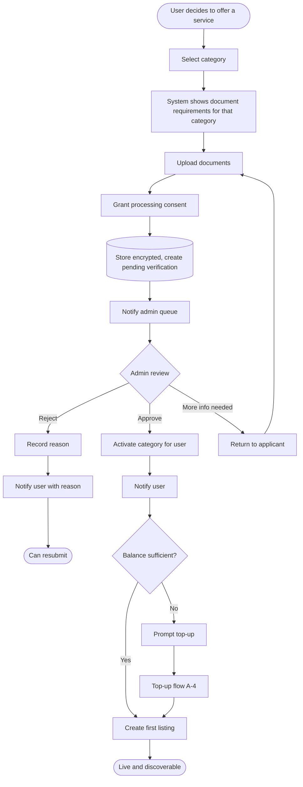
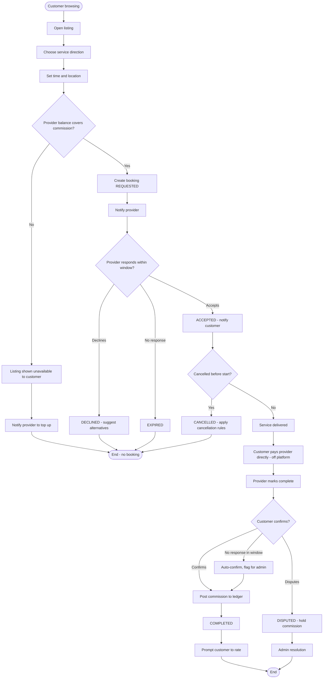
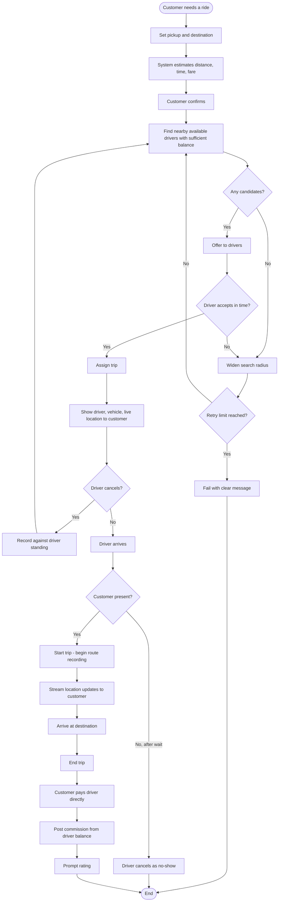
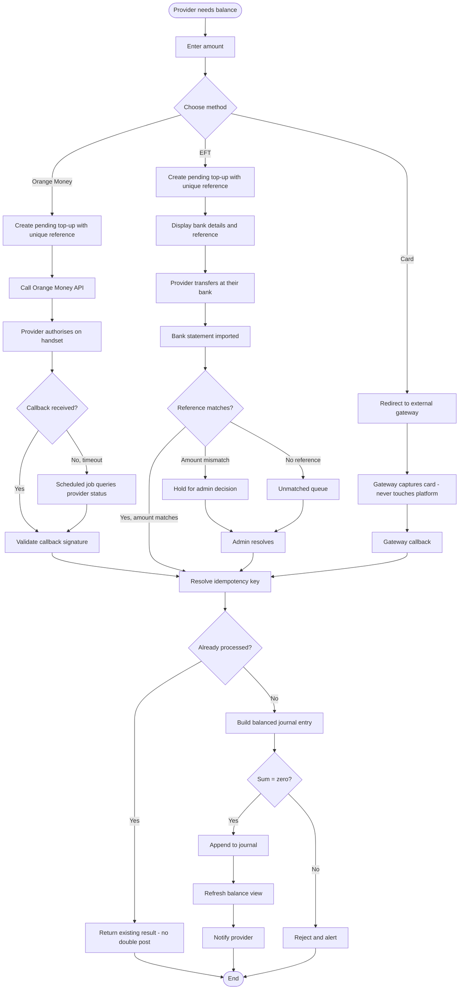
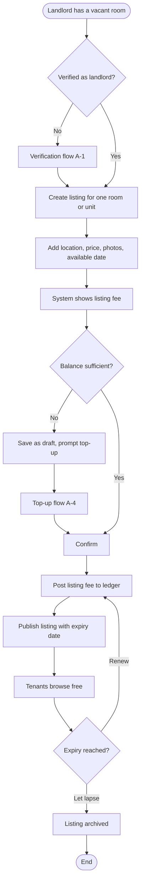
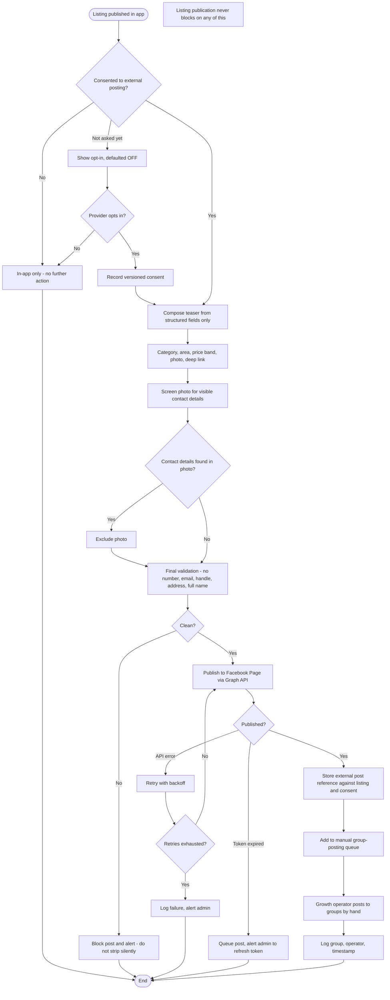
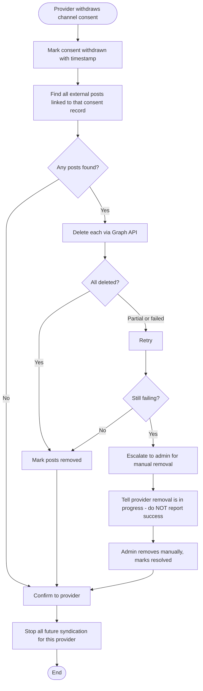
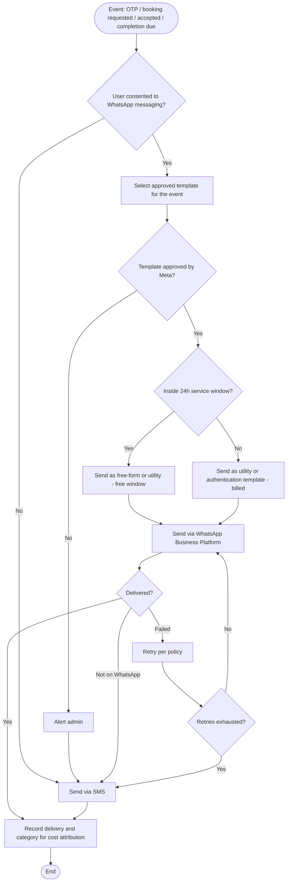

# Activity diagrams

Swimlaned activity flows for the main journeys. State machines and error paths
are in [system flowcharts](system-flowcharts.md).

---

## A-1 · Provider onboarding

---

## A-2 · Booking lifecycle, non-ride

**Note the ordering at D2.** Money changes hands between the two people before
the platform records anything. The platform's ledger entry at F1 concerns only
the commission the provider owes.

---

## A-3 · Ride request and trip

---

## A-4 · Commission credit top-up

**The EFT branch is the expensive one.** Steps C3–C8 involve a human unless the
gateway provides instant EFT. Worth quantifying before launch — it scales with
provider count.

---

## A-5 · Rental listing publication

**The cross-sell moment is at B3.** A tenant who books a room is a mover
customer that same week — this is the ecosystem principle made concrete. Prompt
it there.

---

## A-6 · External channel syndication

**The critical property: this whole flow is downstream and optional.** A Meta
outage, an expired token, or a failed validation must never prevent the listing
going live in the app.

---

## A-7 · Consent withdrawal and takedown

**Honesty is a requirement here.** Reporting a takedown that has not happened is
both a data-protection failure and a trust failure, in a product whose central
claim is trust.

---

## A-8 · Transactional messaging

**Never use marketing templates for transactional events.** They carry no volume
discount and are billed on every delivery. Category selection is a cost
decision, not a labelling formality.
