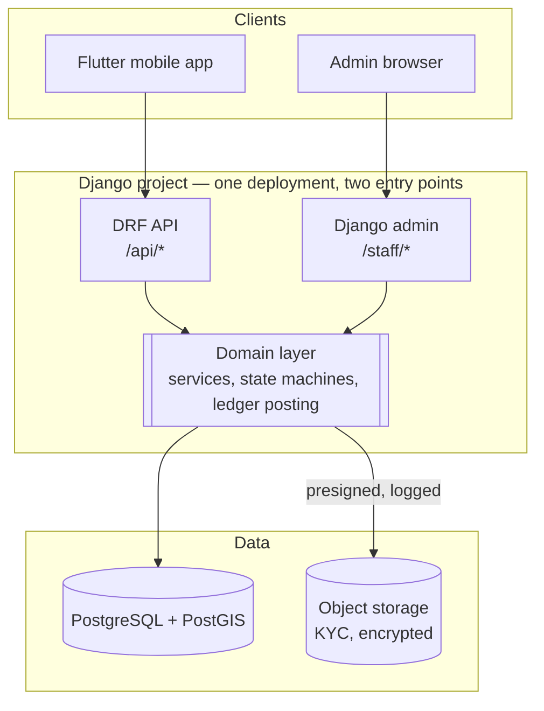

# Admin & back-office

The specification set had nothing on this. It named an "Admin Panel (web — stack
TBD)" in one architecture box and left it there, while simultaneously depending
on admin decisions in five separate flows. This document closes that gap.

**It is not a phase-two panel. It is the other half of the product**, and
several mobile journeys cannot complete without it.

## Why it is on the critical path

| Mobile flow | Waits on a human | If the admin side does not exist |
|---|---|---|
| Become a provider → KYC upload | Category approval | Provider stuck in `PENDING` forever. Listings, bookings and commission are all unreachable — the entire provider journey is undemonstrable. |
| Top-up by EFT | Matching an `UNMATCHED` deposit | Provider pays; balance never moves. [system-flowcharts](system-flowcharts.md) calls this the failure most likely to lose a provider permanently. |
| Cancellation after a fee posted | Confirming or declining the reversal | Sits in `UNDER_REVIEW` with no exit. |
| Dispute raised | Adjudication | Booking never leaves `DISPUTED`; commission held indefinitely. |
| Verification revoked | An admin performing it | Untestable, and the state has no defined behaviour yet anyway. |

Four of those five move money or gate income. That is why this is built
alongside the backend, not after the mobile app.

## Decision: Django admin, not a separate application

**Decided 2026-08-17.** The back office is Django admin inside the same
modular monolith, not a bespoke web app and — explicitly — **not Flutter Web.**

Flutter was considered and rejected for this surface. It is the right tool for
the phone and the wrong one here: back-office work is dense tabular reading,
keyboard-driven queues, document inspection and audited writes. That is what
server-rendered HTML with a mature admin framework does well and what a canvas
renderer does badly — no text selection worth the name, poor find-in-page, heavy
initial payload, and every table, filter and audit trail rebuilt by hand.

Building it in Django instead means the admin surface shares the models, the
validators, the permission model and the audit log with the API rather than
re-implementing them across an HTTP boundary. Two implementations of "approve a
category" is exactly the kind of duplication that lets the two drift, and the
one that drifts is always the one that writes to the ledger.

The counter-argument is honest and worth recording: Django admin is not a good
fit for a *high-volume operations team* with bespoke workflows. If that day
comes, the DRF API is already there and a purpose-built front end can be added
without touching the domain layer. Building it now would be paying that cost
years early, for an operations team of one or two.

## Architecture

**One deployment, two entry points, one domain layer.** The admin never talks to
the database through the ORM directly for anything that carries a rule — it
calls the same service functions the API calls. An admin approving a category
and an automated approval must produce byte-identical state transitions and
audit rows.

### The rule that keeps this honest

> No admin surface may write to a table by field editing when a state
> transition exists for it.

Concretely: `PROVIDER_CATEGORY.status` is **not** an editable dropdown in the
change form. It is read-only, and the transitions are admin *actions* that call
`verification.approve(provider_category, actor, reason)`. Same for booking
state, top-up state and anything in `ledger`.

A dropdown looks like a convenience and is actually an undocumented,
unvalidated, unaudited second implementation of the state machine.

### Deployment

Same Django project, same container image, separated at the edge:

| | Mobile API | Admin |
|---|---|---|
| Path | `/api/*` | `/staff/*` |
| Exposure | Public | **IP-restricted at the load balancer**, plus auth |
| Auth | Phone + OTP, short-lived access tokens | Separate credentials, mandatory 2FA, no shared accounts |
| Session | Stateless tokens | Server session, short idle timeout |
| Database role | `ipelege_app` — no `UPDATE`/`DELETE` on `ledger` | **The same role.** Admin gets no ledger privileges the API lacks. |

That last row is the important one. The temptation is to give the admin a
higher-privileged connection "for corrections". There are no corrections — there
are reversing entries
([database](database.md#1-the-journal-is-append-only-enforced-by-privilege)).

Running admin as a separate deployment of the same image, on a separate
hostname, is a reasonable hardening step and costs little. Worth doing before
launch, not before the first line of code.

## Surfaces

### Queues — the actual daily work

Each is a filtered changelist with a defined SLA and an explicit empty state.
These, not the CRUD, are the product.

| Queue | Source | Action available |
|---|---|---|
| **Verification pending** | `PROVIDER_CATEGORY` where status in `pending`, `more_info` | Approve · Reject · Request more info |
| **Unmatched deposits** | `TOPUP` where status = `unmatched` | Match to provider · Refund · Reject |
| **Reversals under review** | reversal where status = `under_review` | Confirm · Decline (both require a reason) — an **evidence view**, not a decision button; see [cancellation](cancellation.md#admin-surface) |
| **Disputes open** | `DISPUTE` where unresolved | Resolve for provider · Resolve for customer |
| **Blocked external posts** | `EXTERNAL_POST` where status = `blocked` | Investigate — **this indicates a composer bug**, so it alerts rather than waits |
| **Reconciliation mismatches** | scheduled job output | Investigate · Post recovery |

Verification pending is the one with a real business SLA: a provider waiting on
approval is a provider not earning, and the design says the app must name the
expected review window in copy. That number is set by what this queue can
sustain.

### Document review

KYC review is the highest-frequency admin task and the most sensitive.

- Documents are shown through a **view that issues a short-lived presigned URL
  and writes an access record**, never a raw storage link in a template. Every
  view of an identity document is a logged event (NFR-8).
- The reviewer sees the category's requirement list from
  `CATEGORY_REQUIREMENT` alongside the uploads, so "what was this person
  supposed to provide" is not institutional knowledge. The nine categories have
  nine different requirement sets
  ([design-deltas](design-deltas.md#1-nine-categories-not-six)).
- Rejection and more-info both **require a reason**, because the reason is shown
  to the applicant in the app.
- No bulk approve. Ever. Bulk-approving identity verification is the single
  action most likely to destroy the thing the product sells.

### Read-only surfaces

- **Journal and account inspection** — searchable, filterable, exportable, with
  every edit control removed. The admin can see how a balance came to be and
  cannot change it.
- **Booking event history**, which is what a dispute is adjudicated from.
- **Supply metrics per category per city** — this is what M5 in
  [project-plan](project-plan.md) is measured against, and it currently has
  nowhere to be read.
- **Messaging cost by template category**, since `OUTBOUND_MESSAGE.category`
  exists precisely so spend is explainable.

### Growth operator surface

Manual Facebook group posting is outside the system boundary
([dfd](dfd.md)) but the work is coordinated here: the post-ready queue, the
per-day group limits, and `GROUP_POST_LOG` capture of what was actually posted
where. It is a staffed recurring role, not a feature.

## The admin↔app loop

**The admin side is not an independent back office.** Almost every action in the
queues above exists to unblock a person who is sitting in the Flutter app
waiting for it. An admin action that changes state without the app learning
about it is only half-built — the provider refreshes, sees nothing, and
concludes the app is broken.

So each action has a defined consequence on the phone, and that consequence is
part of the action's definition of done, not a follow-up ticket.

| Admin action | App state that changes | How the app learns | What the design says must happen |
|---|---|---|---|
| Approve category | `PROVIDER_CATEGORY` → `approved` | Push + refresh on foreground | Chip crossfades pending → verified. The mode switch stops being disabled. Listings become creatable in that category. |
| Reject / request more info | → `rejected` / `more_info` | Push + refresh | **Instant, at `motion.none`.** Endings and refusals never animate. The reason string is shown verbatim — it is written by the reviewer. |
| Revoke category | → `revoked`, listings deactivated | Push, high priority | Instant. Every listing under it goes inactive at once. **Behaviour for already-accepted bookings is undefined** — this action cannot ship until that is decided. |
| Match an unmatched deposit | `TOPUP` → `settled`, journal posts | Push + balance refresh | Balance animates — `motion.count`, `TweenAnimationBuilder`, 600ms. This is one of only two moments the balance is allowed to move on screen. |
| Confirm reversal | Reversing entries post | Push + balance refresh | **Sequenced, and the order carries meaning:** the reversal rows land first, *then* the balance moves. That is the order the events happened in. |
| Decline reversal | Reversal → `declined` | Push | Nothing moves. The row stays on the ledger with its reason. The balance was never going to change, and must not now. |
| Resolve dispute | Booking → `COMPLETED` or `CANCELLED`, commission posts or releases | Push to both parties | Resolved-for-provider posts commission and completes; resolved-for-customer is instant and terminal. |

### What this requires of the build

- **Every one of those transitions emits a domain event.** The notification is
  produced from the event by process 8.0/9.0, not written inline in the admin
  action. An admin action that sends its own push is an admin action that will
  be forgotten when the same transition happens through the API.
- **Push is a hint, never the source of truth.** These handsets drop
  notifications; the market is 1–2 GB Android on 3G. Every affected screen must
  reach the same state by refresh alone, with no push at all. Test that path,
  because it is the common one.
- **Notification consent is read at action time** ([dfd](dfd.md)), and there is
  no cross-channel fallback: no WhatsApp consent does not mean "send an SMS
  instead".
- **The balance never animates on load.** The design is explicit — a figure that
  animates every time you look at it reads as a live feed. The animation is
  triggered by an observed *change*, which means the client has to know its
  previous value, which means the top-up and reversal screens carry that state
  deliberately rather than re-rendering from scratch.
- **Nothing an admin does may put the app into a state with no copy.** The
  revoked-with-live-bookings case is the live example: the design says that
  state "has no honest copy yet", and shipping the admin action before the copy
  exists means a provider sees a blank or a lie.

### The reverse direction

It also runs the other way, and is easy to miss: the app writes state the admin
depends on. A KYC draft lives **on the server from the moment of upload** rather
than in the widget tree
([design-system](design-system.md#state-restoration)) — that is a
state-restoration requirement on the phone, but it is also what makes a
half-finished application visible to a reviewer at all. A provider who
backgrounds the app mid-upload and never returns still leaves something the
verification queue can act on.

## Security

Inherits the [architecture](architecture.md#security) table, with additions that
apply only here:

| Area | Rule |
|---|---|
| Accounts | Named individuals. No shared logins, no `admin`/`admin`. |
| 2FA | Mandatory, enforced at the framework level, not by policy |
| Network | Admin paths IP-restricted at the load balancer |
| Session | Short idle timeout; re-auth for destructive actions |
| Audit | Every action writes `ADMIN_ACTION` — actor, type, target, reason, timestamp. Non-optional under FR-6.6. |
| Document access | Logged individually, presigned, short expiry |
| Ledger | No privilege to update or delete. Reversing entries only. |
| Erasure | An admin can *action* an erasure request; the erasure itself runs as a defined job, not as manual deletion |

`ADMIN_ACTION` is written by the domain service, not by the admin view — so an
action taken through the API, a management command or a future front end is
recorded identically.

## Testing

Covered in [test-strategy](test-strategy.md). The split matters:

- **Not tested:** Django's own generic CRUD, list rendering, pagination. That is
  the framework's test suite, not ours.
- **Tested:** every custom admin action, because each one moves money or gates
  income — approve/reject/more-info, confirm/decline reversal, match deposit,
  resolve dispute. Each asserts the state transition, the `ADMIN_ACTION` row and
  the ledger consequence.
- **Tested:** that the journal admin offers no write path, and that a `POST` to
  a journal change form fails.

## Build sequence

Admin capability lands with the feature it unblocks, not in one lump at the end:

| With | Build |
|---|---|
| Identity & accounts | Staff auth, 2FA, `ADMIN_ACTION` plumbing, user search |
| Ledger core | Journal and account inspection, read-only |
| Category & verification model | Verification queue, approve/reject/more-info, document review with logged access |
| Top-up — Orange Money | Top-up inspection |
| Top-up — EFT | Unmatched-deposit queue and matching action |
| Booking lifecycle | Booking and event inspection |
| Commission on completion | Reversal queue, confirm/decline |
| Dispute handling | Dispute resolution actions |
| Syndication worker | Blocked-post queue, growth-operator surface |

The first row is the only one that is admin-specific work up front; everything
after it is one file alongside the feature that needs it. That is the whole
argument for Django in one table.

## Open

- **Who staffs these queues at launch**, and what verification SLA they can
  sustain. The app copy has to name a number, so this is a product decision, not
  an ops one.
- Whether admin runs as a separate deployment of the same image from day one, or
  is split later.
- Whether reversal confirmation needs two-person approval above some amount.
- Retention for `ADMIN_ACTION` — currently assumed indefinite.
- Whether the growth-operator surface belongs in Django admin at all, or is
  better as a shared sheet until the volume justifies it.
