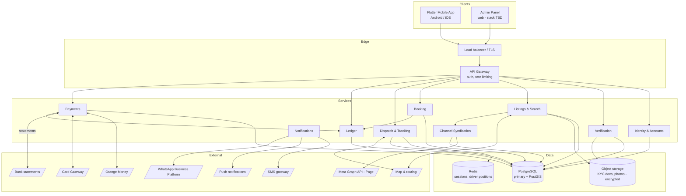

# System architecture

## Constraints shaping this

- **Data residency:** a copy of personal data must remain in Botswana
  ([compliance](compliance.md)) — this constrains hosting before anything else
- **No card data on platform servers** — PCI scope avoidance
- Mobile client is Flutter
- GPS tracking assembled from open-source components
- Small team; favour boring, well-understood technology

## High-level architecture

**"Services" here means modules, not microservices.** At this stage build a
modular monolith with clear internal boundaries. The boundaries drawn above are
where you would later split if you ever need to — but splitting now would cost
a small team far more than it returns.

## Key decisions and reasoning

| Decision | Choice | Why |
|---|---|---|
| Mobile | Flutter | Already decided; one codebase, both platforms |
| Backend | **Django 5 + DRF + GeoDjango** — decided 2026-08-17, see below | |
| Database | PostgreSQL + PostGIS | Geospatial queries for service areas and driver proximity; strong transactional guarantees, which the ledger requires |
| Ledger storage | Same PostgreSQL, separate schema | Ledger correctness depends on transactional integrity with booking state. A separate database would introduce distributed-transaction problems you do not need |
| Live positions | Redis | High write volume, short lifetime, no durability need |
| Maps & routing | Open-source stack | CON-6. MapLibre for rendering; a routing engine such as OSRM or Valhalla; OpenStreetMap data. Avoids per-request commercial pricing at unknown volume |
| Documents | Object storage, encrypted, access-logged | NFR-8, and DPA storage-limitation rules need per-object retention |
| Card handling | Redirect to gateway | NFR-7 — no PCI scope |
| Channel syndication | Async worker, queue-backed | Must never block listing publication. A Meta outage degrades reach, not core function |
| Messaging | WhatsApp Business Platform with SMS fallback | Providers already live on WhatsApp; utility/auth templates are cheap. SMS remains the fallback, not the default |

### Backend — decided

**Django 5 + Django REST Framework + GeoDjango, on PostgreSQL 16 + PostGIS.**
Decided 2026-08-17. Physical design in [database](database.md).

Three reasons, in order of weight:

1. **The admin side is not optional, and Django admin is most of it.** See the
   section below — KYC approval, reversal adjudication and EFT reconciliation
   are all blocking, human, back-office work. Every other candidate meant
   building a second application to do them.
2. **Money arithmetic is correct by default.** Python's `Decimal` against
   `numeric(12,2)` is the right pairing for an append-only ledger carrying
   separate fee and VAT entries. JavaScript has no native decimal, which makes
   every money calculation a discipline problem that has to be got right every
   time rather than once.
3. **GeoDjango is first-class PostGIS.** Service areas, coverage queries and
   distance filtering are ORM-level rather than raw SQL.

The cost, named honestly: Python is a second language alongside Dart, and there
is no code sharing between client and server. That was true of every option —
nothing on the shortlist shares a language with Flutter — so it did not
discriminate.

**Throughput was not a factor and should not become one.** Nothing here is
throughput-bound at launch volumes.

### The admin side has to be built alongside, not after

Worth stating plainly because it changes sequencing: **several mobile journeys
cannot complete without a human on the other side.**

| Mobile flow | Blocks on | Consequence if the admin side is missing |
|---|---|---|
| Become a provider → KYC upload | An admin approving the category | The provider is stuck in `PENDING` forever. Nothing downstream — listings, bookings, commission — can be demonstrated at all. |
| Top-up by EFT | An admin matching an `UNMATCHED` deposit | The provider pays and their balance never moves. [system-flowcharts](system-flowcharts.md) calls this the failure most likely to lose a provider permanently. |
| Cancellation after a fee posted | An admin confirming or declining the reversal | The reversal sits in `UNDER_REVIEW` with no exit. |
| Dispute raised | An admin adjudicating | The booking never leaves `DISPUTED`, and commission is held indefinitely. |
| Category revoked | An admin performing the revocation | Untestable. |

So the answer to "do we need a simultaneous build of the admin side" is **yes,
but far less of one than it sounds** — and that is precisely why Django was
chosen over the alternatives.

What Django admin gives with configuration rather than construction: the KYC
review queue with document preview, the pending-verification list, the
unmatched-deposit queue, ledger and journal inspection, user and listing search,
and a complete audit trail of who did what. Roughly one file per model.

What must still be written by hand, because it is ours and it moves money:

- **Approve / reject / request-more-info** as admin actions that write
  `PROVIDER_CATEGORY` transitions and `ADMIN_ACTION` rows — not raw field edits.
- **Confirm / decline reversal**, which instructs process 6.0 to post the
  mirrored entries. Never a direct journal write; the app role has no privilege
  to do that anyway ([database](database.md#1-the-journal-is-append-only-enforced-by-privilege)).
- **Match an unmatched EFT deposit** to a provider account.
- **Read-only enforcement on the journal**, so the admin UI cannot offer an edit
  form for a table that would reject the write.

**The separate web admin panel — the one this document lists as "stack TBD" —
is now deferred, possibly permanently.** It was contemplated because no backend
had been chosen. A bespoke React admin should only be built if and when an
operations team outgrows Django admin, and that is a good problem to have later
rather than a phase-one commitment.

Two constraints on Django admin as an operational surface, both from
[compliance](compliance.md) and the security table below: separate credentials
with mandatory 2FA and no shared accounts, and every KYC document access
written to the audit log — which means document viewing goes through a
presigned-URL view that logs, never a raw storage link in a template.

## Hosting cost before there is an audience

A fair question: **why spend on hosting before anyone is using this?** The
answer has three parts, and the first one is not negotiable.

### A server is not optional

There is no configuration of this product that has no server:

| Forces a public server | Why |
|---|---|
| **Orange Money callbacks** | The gateway `POST`s to a public HTTPS URL. It cannot call a laptop or a desktop app. Without it, top-ups never settle. |
| **The Flutter app** | Needs an API. Nine categories of listings, bookings and balances are not local state. |
| **Push notifications** | Every admin decision has to reach a phone ([admin](admin.md#the-adminapp-loop)). |
| **OTP** | Phone + OTP is the entire identity model. |
| **The ledger** | Shared, authoritative, transactional. It cannot live on a client. |

So the question is not *whether* to host, but *how cheaply*.

### Why the admin is not a Windows desktop app

A desktop admin was considered. It does not save the hosting — it moves it — and
it introduces a problem the web version does not have.

**A desktop app talking straight to the database means shipping database
credentials inside a binary.** Anyone who obtains that binary obtains the KYC
documents and the financial ledger. It also destroys the enforcement model in
[database](database.md#rules-the-database-enforces-not-the-application): the
append-only privilege, the audit trail and the "no field edit where a state
transition exists" rule all assume writes go through one server-side domain
layer. A desktop client is a second, unaudited writer.

A desktop app talking to the API instead is safe — and is then **strictly more
work than Django admin**, because the API and the server exist either way and
the admin screens would be built twice.

The same reasoning rules out a Flutter Windows build for the admin. Flutter is
right for the phone; it is not right for dense tabular queue work, and it would
not remove a single hosting cost.

**Django admin adds no hosting at all.** It is the same process, the same
container, the same database — a different URL path.

### Why not Firebase

Firestore is a document store. Adopting it means discarding
[data-model](data-model.md), [database](database.md) and the double-entry ledger
in their entirety:

- **No PostGIS.** Service areas, coverage queries and driver proximity are core
  to five categories.
- **No SQL transactions of the shape a ledger needs.** Double-entry requires a
  balanced set to commit atomically or not at all, with a deferred check. That
  is the one guarantee the money side cannot do without.
- **No Django ORM, no Django admin.** The back-office argument disappears with
  it.
- **Lock-in.** This is the decisive one. Firebase data does not move. Given
  [data residency](compliance.md) will *force* a migration to Botswana-resident
  hosting before launch, choosing a database you cannot migrate off is choosing
  to rebuild later.

### The actual plan — free now, compliant later

The residency requirement binds when **real personal data** is being processed.
During build, with synthetic data, it does not apply. That splits hosting into
two phases and defuses the cost concern entirely.

**Phase 0 — build and internal testing. Target cost: around P60/month.**

**A single cheap VPS is the recommendation**, and it is a better fit than a
managed platform for one specific reason: **you get superuser on PostgreSQL.**

The ledger's whole enforcement model — the `REVOKE` on the journal tables, the
immutability triggers, the deferred balance constraint, custom roles
([database](database.md#rules-the-database-enforces-not-the-application)) —
requires privileges that some managed Postgres plans do not grant. On your own
VPS that concern disappears entirely, along with free-tier pauses, egress caps
and storage limits.

One box runs everything at launch volumes. Nothing here is throughput-bound.

| Component | On the VPS |
|---|---|
| App | Django + gunicorn behind Caddy (automatic Let's Encrypt) |
| Database | PostgreSQL 16 + PostGIS — full superuser |
| Cache / live positions | Redis |
| Object storage | MinIO, S3-compatible, so `django-storages` config is identical in production |
| Background jobs | Celery or `django-q2` — syndication, retention, reconciliation, the event relay |
| Routing | OSRM, Botswana OSM extract |
| Local dev | Docker Compose, same images ([database](database.md#local-development)) |

**Spec floor: 4 GB RAM minimum, 8 GB comfortable.** RAM is the binding
constraint, not CPU. Check the spec, not just the price — local providers
sometimes price per GB differently from budget European hosts.

Worked sizing for the full stack on one box:

| Service | RAM | Note |
|---|---|---|
| PostgreSQL 16 + PostGIS | ~2.5 GB | `shared_buffers` ~2 GB. The one to give room to. |
| OSRM | ~0.5–1 GB | Largest single *variable*. Botswana is a small extract; a country the size of Germany would not fit. |
| Django + gunicorn | ~0.8 GB | 3–4 workers |
| Celery worker | ~0.4 GB | |
| MinIO | ~0.4 GB | |
| Redis | ~0.3 GB | Driver positions are tiny |
| Caddy + OS | ~0.5 GB | |
| **Total** | **~5.5 GB** | Fits 8 GB with real headroom. Tight but workable on 4 GB if OSRM moves off-box. |

**Disk is the sleeper constraint, not RAM.** 100 GB is ample at first, and the
thing that fills it is **listing photos**, followed by KYC documents (a few MB
per provider). `trip_location` is bounded because it is partitioned and dropped
([database](database.md#trip_location-is-partitioned)). Resize images
aggressively server-side, and treat object storage as the first thing to move
off the box when it grows — it is also the easiest, since it is already
S3-compatible behind `django-storages`.

> **A provider snapshot is not a backup.** It sits on the same infrastructure
> and does not help against a bad migration noticed a week later. Automate
> `pg_dump` **off-box** from day one and test the restore. This is the single
> failure that ends the project, and it costs nothing to prevent.

### Split by data sensitivity, not by service

Worth stating because it is the escape hatch if local capacity turns out
expensive: **residency attaches to personal data, not to everything.**

| Must be Botswana-resident | Can be hosted anywhere |
|---|---|
| `identity` schema — names, phones, email, KYC documents | **OSM map tiles** — public data, nobody's |
| `core` — bookings, listings, trips, locations | **OSRM routing** — a road graph, contains no user data |
| `ledger` | Static assets, CDN |
| Object storage holding KYC and photos | CI, staging, dev environments |

The map and routing services are the memory-hungry part of the stack *and* the
part with no residency obligation whatsoever. If a Gaborone quote for a large
box is uncomfortable, put a small resident box in front of the data and push
OSRM and tiles onto cheap foreign capacity. Latency on a routing call is not
user-visible in the way a database round-trip is.

Do not split it this way from the start — one box is simpler and simpler is
correct at zero users. But knowing the seam exists means a price quote cannot
block the project, and it is also the escape hatch if OSRM will not build on
ARM.

### Hosting is a safety decision too

Not only compliance. Once the evidence trail is the safety model
([safety](safety.md#the-tracking-trail-is-the-safety-model)), the box holding it
is safety-critical: a report button that is down during an incident does not
exist, evidence lost is a case that cannot be made, and a police enquiry lands
in a Botswana jurisdiction rather than a French one.

**This is the strongest argument against depending on a free tier for anything
real.** Oracle halving its allowance with no notice is an acceptable risk for a
dev box and an unacceptable one for the records a police enquiry will ask for.
It also argues for going straight to resident hosting if the price is close —
it removes a migration from precisely the period when the safety model first
goes live.

### The hosting path, end to end

| When | Where | Cost |
|---|---|---|
| **Now — build** | Oracle Always Free, 2 OCPU / 12 GB, Johannesburg region | **P0** |
| **Fallback if Oracle disappoints** | Contabo VPS 4 (8 GB) or Hetzner CX22 (4 GB) | ~P70–90/month |
| **First real user** | Botswana-resident box — Digital Delta DC1, Atal or C-Nest | Quote pending |

The move between any two of these is `docker compose up` plus a database
restore. That portability is worth more than any individual provider choice,
and it is why the stack was kept boring.

Managed Postgres (Supabase, Neon) remains a reasonable fallback if you would
rather not administer a box — Supabase for its bundled object storage, Neon for
the better database. Both are real PostgreSQL, so nothing in the schema changes
either way. **If you go managed, verify PostGIS and the privilege statements
first**; a platform that forbids `REVOKE` on your own tables cannot enforce the
append-only journal, which is disqualifying rather than inconvenient.

**What a VPS costs you that a managed platform does not:** backups, PITR,
patching, TLS renewal, and restore testing. At this scale that is a few hours a
month, not a role — but the failure mode that ends this project is *a single VPS
holding the ledger with a backup nobody has ever restored*. Automate the dump
off-box on day one and test the restore before there is anything worth losing.

### Free capacity for phase 0

Only two providers offer a genuinely always-on free VPS in 2026, and only one is
big enough to run this stack.

| Option | Spec | Cost | Verdict |
|---|---|---|---|
| **Oracle Cloud Always Free** | **2 OCPU ARM (Ampere A1), 12 GB RAM**, 200 GB block storage, 10 GB object storage, 10 TB egress/month | **$0, permanently** | **Best free option.** More RAM and more disk than the paid Contabo box. Has a Johannesburg region — good latency to Botswana. |
| Google Cloud Always Free | e2-micro, 1 GB RAM, 30 GB disk | $0 | **Too small.** Postgres alone wants more than this. |
| AWS / Azure free tiers | ~1 GB, 12 months only | $0 then billed | Time-limited, so it is a trial, not a base |

**Take the Oracle free tier for phase 0 — but treat it as disposable.**

Oracle **halved the Always Free ARM allowance in June 2026** — from 4 OCPU /
24 GB down to 2 OCPU / 12 GB — with no blog post, no customer email and no
announcement of any kind. Users found out when their instances were shut down,
and over-limit instances were terminated from 18 August 2026. Capacity errors
and account closures are also commonly reported.

That is not a reason to avoid it. It is a reason to **owe it nothing**:

- Everything runs from Docker Compose, so the box is reproducible in an hour
- `pg_dump` runs off-box on a schedule from day one
- Nothing lives there that cannot be lost

Which is already the architecture — that is the point of choosing boring,
portable pieces. The free tier is then upside rather than a dependency.

### ARM — resolved, no blocker

**Ampere A1 is ARM (aarch64).** Django, PostgreSQL, PostGIS, Redis, MinIO and
Caddy all publish multi-arch images and pull arm64 layers automatically.

**Routing was the open question. It is now closed by switching engine.**
Registry manifests, checked directly:

| Image | Platforms | Last published |
|---|---|---|
| `ghcr.io/gis-ops/docker-valhalla/valhalla` | **linux/amd64, linux/arm64** | current |
| `osrm/osrm-backend` (Docker Hub) | linux/amd64 only | **July 2021** — five years stale |

**Valhalla replaces OSRM** ([components](components.md#routing--valhalla)). It
pulls natively on arm64, is actively published, has the map matching that
[cancellation evidence](cancellation.md) needs, and runs on raw OSM without a
preprocessing step. The Botswana extract is **83 MB**, so the throughput
advantage OSRM held is irrelevant here.

OSRM itself is not broken on ARM — its GitHub releases ship `linux-arm64`
prebuilt assets and are current (v26.8.0, August 2026). It is only the Docker
Hub images that are amd64 and abandoned. But since Valhalla needs neither a
build step nor a workaround, there is no reason to take one.

**Nothing in the stack now requires x86.** That said, Oracle's free account also
includes 2× AMD micros (`VM.Standard.E2.1.Micro`, 1/8 OCPU, 1 GB RAM, 47 GB boot
volume) which were **not** cut in the June 2026 reduction — useful for a small
x86 job if one ever appears.

Sequencing note: routing is not needed until Rides, which is section 4 of the
[project plan](project-plan.md). This was never going to block phase 0 — but it
is now settled rather than deferred.

**Cheaper paid alternatives**, if you would rather not depend on Oracle's mood:
Hetzner is generally better value than Contabo (CX22 — 2 vCPU, 4 GB, 40 GB, around
€4/month), though 4 GB is the floor rather than comfortable, and like Contabo it
has no African presence. Both are fine for a dev/staging box.

### Two viable routes for production, both giving root

| Route | Root access | Residency | Notes |
|---|---|---|---|
| **Botswana provider** | Yes | ✅ **Satisfied** | **Digital Delta DC1** — Tier III, BoFiNet-operated, at the Botswana Digital & Innovation Hub, Block 8. Colocation, rack rental, IaaS, explicitly for infrastructure inside Botswana. Also **Atal Networks** (Gaborone VPS) and **C-Nest** (Gaborone DC). |
| **Contabo** | Yes | ❌ EU only | No African data centre; Africa is served from the Lauterbourg hub on the French-German border. Excellent value, and personal data would sit in **France**. |

**If local pricing is in the same range, start local and stay there.** That
collapses the phase 0 / phase 1 split for hosting entirely: no migration, no
judgement call about when the line gets crossed, and no risk of onboarding a
real user onto a box in the wrong jurisdiction because the move had not happened
yet. It is the simpler plan and it is available.

Contabo then has a narrower and still useful role: **a dev / staging / CI box**,
where the data is synthetic and jurisdiction is irrelevant. Cheap capacity for
throwaway environments is worth having.

**One trap worth flagging**, since it is not visible from the marketing:
several products branded "VPS Hosting Botswana" are physically at **NAPAfrica in
Johannesburg**. Latency is genuinely good — under 10 ms to Gaborone and
Francistown — but residency is jurisdiction, not milliseconds, so those satisfy
performance and not the Act. Confirm the actual facility, not the label.

> **Get a quote from Digital Delta DC1 early.** [compliance](compliance.md)
> lists hosting and residency as an external decision with real lead time, and
> price has been the missing input. A number from a Gaborone facility converts
> the project's second-largest open blocker into arithmetic — and if it lands
> near P60/month, the blocker essentially closes.

Because the residency requirement attaches to **personal data specifically**,
the `identity` schema is the piece that must stay local. If a split topology
ever becomes necessary for cost reasons, that schema is the boundary — a second
reason for the separation in [database](database.md#engine).

## Deployment topology

**The residency requirement is the deciding factor.** A copy of personal data
must remain in Botswana for the duration of processing. Options, in order of
preference:

1. **Local hosting in Botswana with a local provider** — the recommended route.
   Concrete capacity exists (Digital Delta DC1, Atal, C-Nest), and if pricing is
   near the cost of a budget foreign VPS there is no reason to choose anything
   else. See [above](#two-viable-routes-both-giving-root).
2. Foreign cloud with a compliant replicated copy held locally — more moving
   parts, and the replica is then the thing that must never fall behind
3. Foreign cloud only — **likely non-compliant on the face of the Act**

This decision affects latency, cost, operational tooling and hiring. It is not
a late-stage infrastructure detail — but with local pricing established it stops
being an open-ended one.

## Channel syndication — design notes

**Isolate it.** Syndication and messaging sit behind a queue and run
asynchronously. Nothing in the listing or booking path waits on an external
Meta call.

| Concern | Approach |
|---|---|
| Failure isolation | Queue-backed workers; failures retry and alert, never propagate upstream |
| Token lifecycle | Long-lived Page tokens expire. Monitor expiry and alert *before* posting starts failing silently |
| Rate limiting | Respect Graph API limits; back off rather than retry aggressively |
| Content gate | Every outbound post passes the safety gate in [system-flowcharts](system-flowcharts.md). No bypass path, including for admin |
| Consent | Read at action time from the consent store, never cached |
| Takedown | Deletion path built and tested alongside the create path — it is a legal obligation, not a nice-to-have |
| Cost attribution | Every outbound message records its template category, so messaging spend is explainable |

**Concentration risk worth naming in the architecture, not just the strategy:**
Facebook Page, WhatsApp and the ad platform are all Meta. A single account
restriction could remove customer discovery, provider messaging and OTP delivery
at once. Keep SMS working as a genuine fallback rather than a legacy path, and
retain provider phone numbers directly.

## Security

| Area | Approach |
|---|---|
| Auth | Phone + OTP; short-lived access tokens, refresh tokens |
| Admin auth | Separate credentials, mandatory 2FA, no shared accounts |
| KYC documents | Encrypted at rest; every access written to the audit log |
| Ledger | Append-only; no application code path issues UPDATE or DELETE on journal tables; enforce at the database privilege level, not by convention |
| Card data | Never received — redirect model |
| Location data | Retention-limited; treated as personal data |
| Transport | TLS everywhere, certificate pinning on mobile |

## Scaling notes

Nothing here needs to scale at launch. Two things are worth building correctly
from the start because retrofitting them is expensive:

1. **Idempotency keys on every money operation** — cheap now, near-impossible to
   backfill safely
2. **Identity/transaction separation** — required for erasure rights, and
   restructuring a live ledger is the worst kind of migration

Everything else can be optimised when there is traffic to justify it.
