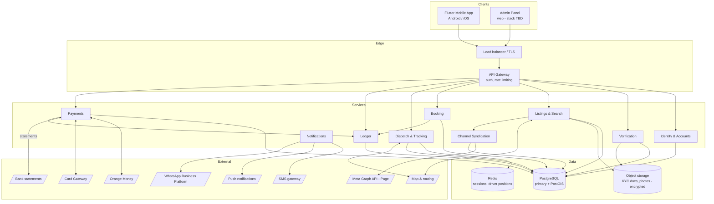
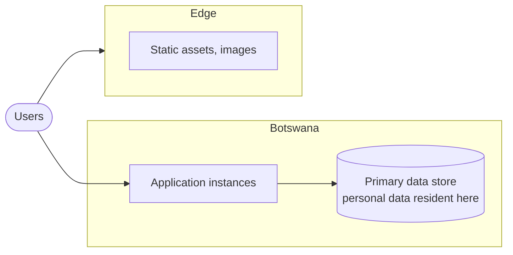

# System architecture

## Constraints shaping this

- **Data residency:** a copy of personal data must remain in Botswana
  ([compliance](compliance.md)) — this constrains hosting before anything else
- **No card data on platform servers** — PCI scope avoidance
- Mobile client is Flutter
- GPS tracking assembled from open-source components
- Small team; favour boring, well-understood technology

## High-level architecture

**"Services" here means modules, not microservices.** At this stage build a
modular monolith with clear internal boundaries. The boundaries drawn above are
where you would later split if you ever need to — but splitting now would cost
a small team far more than it returns.

## Key decisions and reasoning

| Decision | Choice | Why |
|---|---|---|
| Mobile | Flutter | Already decided; one codebase, both platforms |
| Backend | **Open** — see below | |
| Database | PostgreSQL + PostGIS | Geospatial queries for service areas and driver proximity; strong transactional guarantees, which the ledger requires |
| Ledger storage | Same PostgreSQL, separate schema | Ledger correctness depends on transactional integrity with booking state. A separate database would introduce distributed-transaction problems you do not need |
| Live positions | Redis | High write volume, short lifetime, no durability need |
| Maps & routing | Open-source stack | CON-6. MapLibre for rendering; a routing engine such as OSRM or Valhalla; OpenStreetMap data. Avoids per-request commercial pricing at unknown volume |
| Documents | Object storage, encrypted, access-logged | NFR-8, and DPA storage-limitation rules need per-object retention |
| Card handling | Redirect to gateway | NFR-7 — no PCI scope |
| Channel syndication | Async worker, queue-backed | Must never block listing publication. A Meta outage degrades reach, not core function |
| Messaging | WhatsApp Business Platform with SMS fallback | Providers already live on WhatsApp; utility/auth templates are cheap. SMS remains the fallback, not the default |

### Backend language — the open decision

Not chosen. The constraint worth naming: whoever maintains this after launch has
to understand it. Options that fit a small team are Node/TypeScript, Python
(Django or FastAPI), or Go. If the same person writing Flutter also writes the
backend, sharing a language with the admin panel matters more than raw
performance at this scale.

**Do not choose based on throughput benchmarks.** Nothing here is
throughput-bound at launch volumes.

## Deployment topology

**The residency requirement is the deciding factor, and it needs resolving
early.** A copy of personal data must remain in Botswana for the duration of
processing. Options, in rough order of preference:

1. Local hosting in Botswana with a local provider
2. Foreign cloud with a compliant replicated copy held locally
3. Foreign cloud only — **likely non-compliant on the face of the Act**

This decision affects latency, cost, operational tooling and hiring. It is not
a late-stage infrastructure detail.

## Channel syndication — design notes

**Isolate it.** Syndication and messaging sit behind a queue and run
asynchronously. Nothing in the listing or booking path waits on an external
Meta call.

| Concern | Approach |
|---|---|
| Failure isolation | Queue-backed workers; failures retry and alert, never propagate upstream |
| Token lifecycle | Long-lived Page tokens expire. Monitor expiry and alert *before* posting starts failing silently |
| Rate limiting | Respect Graph API limits; back off rather than retry aggressively |
| Content gate | Every outbound post passes the safety gate in [system-flowcharts](system-flowcharts.md). No bypass path, including for admin |
| Consent | Read at action time from the consent store, never cached |
| Takedown | Deletion path built and tested alongside the create path — it is a legal obligation, not a nice-to-have |
| Cost attribution | Every outbound message records its template category, so messaging spend is explainable |

**Concentration risk worth naming in the architecture, not just the strategy:**
Facebook Page, WhatsApp and the ad platform are all Meta. A single account
restriction could remove customer discovery, provider messaging and OTP delivery
at once. Keep SMS working as a genuine fallback rather than a legacy path, and
retain provider phone numbers directly.

## Security

| Area | Approach |
|---|---|
| Auth | Phone + OTP; short-lived access tokens, refresh tokens |
| Admin auth | Separate credentials, mandatory 2FA, no shared accounts |
| KYC documents | Encrypted at rest; every access written to the audit log |
| Ledger | Append-only; no application code path issues UPDATE or DELETE on journal tables; enforce at the database privilege level, not by convention |
| Card data | Never received — redirect model |
| Location data | Retention-limited; treated as personal data |
| Transport | TLS everywhere, certificate pinning on mobile |

## Scaling notes

Nothing here needs to scale at launch. Two things are worth building correctly
from the start because retrofitting them is expensive:

1. **Idempotency keys on every money operation** — cheap now, near-impossible to
   backfill safely
2. **Identity/transaction separation** — required for erasure rights, and
   restructuring a live ledger is the worst kind of migration

Everything else can be optimised when there is traffic to justify it.
