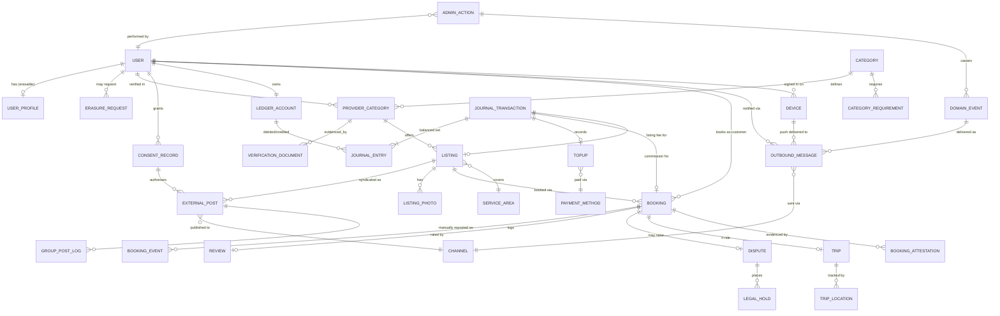

# Data model

## Design rules

Three rules drive the shape of this model. Each exists for a reason recorded
elsewhere in the spec.

1. **Identity is separated from transactions.** The ledger references an account
   ID, never personal data. This lets a data-subject erasure request be honoured
   without destroying financial history — the conflict noted in
   [compliance](compliance.md).

2. **The ledger is immutable and double-entry.** Every movement is a balanced
   pair of entries. Balances are a *derived view* over the journal, never the
   source of truth. Corrections are reversing entries, never edits. This is the
   standard pattern for financial systems and the reason it is used here is
   auditability — you can always reconstruct how a balance came to be.

3. **Verification attaches to the category, not the user.** A user is verified
   *as a driver*, separately from being verified *as a landlord*.

## ER diagram

## Entity dictionary

### Identity (erasable)

**USER** — `id`, `email`, `password`, `phone`, `phone_hash`,
`phone_verified_at`, `status`, `created_at`, `is_staff`
The stable anchor and the Django auth model. Deliberately thin, but no longer
phone-only: phase 0 registration uses email + password because SMS OTP is
deferred until an aggregator is affordable
([components](components.md#auth--adopt-and-phase-it)). `email` and `password`
must live here for authentication to work at all.

`phone` is **unique from the start, even while unverified** — the rule cannot be
verified yet but it can be enforced, which turns a future migration conflict
into a registration-time error today.

On erasure `email` is overwritten with a placeholder rather than nulled, because
Django requires a unique non-null `USERNAME_FIELD`.

**USER_PROFILE** — `user_id`, `first_name`, `surname`, `photo_url`, `id_number`,
`erased_at`
All remaining directly identifying data. **This is the table an erasure request
empties.** Everything else survives.

**ERASURE_REQUEST** — `id`, `user_id`, `requested_at`, `status`
(queued | blocked | completed), `blocking_reason`, `completed_at`,
`backups_clear_at`
Erasure is a tracked request, not an immediate delete. A user with an open
dispute or a live booking is **blocked**, with the reason shown in the app
rather than the request silently doing nothing. `backups_clear_at` records when
the last backup containing the person ages out of the stated window — an
erasure that leaves someone in last night's dump is not an erasure.

**CONSENT_RECORD** — `id`, `user_id`, `consent_type`, `version`, `granted_at`,
`withdrawn_at`
Versioned consent. Required by the Data Protection Act 2024; must show *what*
was consented to and *when*.

`consent_type` values include at minimum: `terms`, `kyc_processing`,
`external_syndication` (publishing listings to Facebook), `messaging_whatsapp`,
`location_tracking`. **Granular and separate** — a single blanket consent does
not satisfy the Act, and bundling syndication into general terms is exactly the
pattern regulators object to. Syndication and messaging consents default to
**off**.

### Provider & verification

**CATEGORY** — `id`, `slug`, `name`, `booking_model` (browse | dispatch | listing_fee),
`commission_rate`, `active`
The six launch categories are rows here, not code branches. Adding a category
should not require a deploy.

**CATEGORY_REQUIREMENT** — `id`, `category_id`, `document_type`, `mandatory`
Drives the per-category KYC document list.

**PROVIDER_CATEGORY** — `id`, `user_id`, `category_id`, `status` (pending |
approved | rejected | revoked), `approved_at`, `approved_by`
The join that makes per-category verification work.

**VERIFICATION_DOCUMENT** — `id`, `provider_category_id`, `document_type`,
`storage_ref`, `uploaded_at`, `retention_until`
Encrypted at rest, access logged. `retention_until` enforces storage limitation.

### Listings

**LISTING** — `id`, `provider_category_id`, `title`, `description`,
`service_direction` (provider_travels | client_travels | both), `pricing_type`,
`price`, `status`, `published_at`, `expires_at`
`service_direction` is here rather than on the category — it varies per listing.

**SERVICE_AREA** — `id`, `listing_id`, `centre_point`, `radius_m`, or a polygon
For provider-travels listings. For client-travels, a fixed point.

**LISTING_PHOTO** — `id`, `listing_id`, `storage_ref`, `position`

### Bookings

**BOOKING** — `id`, `listing_id`, `customer_id`, `provider_id`, `state`,
`direction_chosen`, `scheduled_at`, `location`, `agreed_price`,
`commission_amount`, `completed_at`
`commission_amount` is captured at booking time so a later rate change does not
retroactively alter what was owed.

**BOOKING_EVENT** — `id`, `booking_id`, `from_state`, `to_state`, `actor_id`,
`reason`, `occurred_at`
Append-only state history. This is what a dispute is adjudicated from.

**TRIP** — `id`, `booking_id`, `pickup`, `destination`, `started_at`,
`ended_at`, `distance_m`, `route_polyline`

**TRIP_LOCATION** — `id`, `trip_id`, `point`, `recorded_at`
High volume, short retention. Personal data under the DPA — set a retention
period and enforce it.

**REVIEW** — `id`, `booking_id`, `rating`, `comment`, `created_at`

**DISPUTE** — `id`, `booking_id`, `raised_by`, `reason`, `status`,
`resolution`, `resolved_by`

**BOOKING_ATTESTATION** — `id`, `booking_id`, `kind` (arrival | completion |
customer_arrival), `actor_id`, `attested_at`, `point`, `accuracy_m`, `is_mock`,
`distance_to_target_m`, `photo_ref`
Evidence that someone was where they said they were. `attested_at` is the
**server clock** — a device clock is an input the subject controls. Without
this, seven of the nine categories produce no evidence a service happened at
all, and reversals cannot be adjudicated. Append-only, same treatment as
`BOOKING_EVENT`. See [cancellation](cancellation.md).

Location data, so it is personal data: it carries a retention period, and
`accuracy_m` travels with the coordinate because it bounds what the record can
honestly be claimed to prove.

**LEGAL_HOLD** — `id`, `subject_type`, `subject_id`, `reason`, `placed_at`,
`released_at`
Exempts evidence from the retention sweepers while a dispute or reversal is
open. **Placed in the same transaction that raises the dispute**, not by a
follow-up job that can fail. A sweeper that deletes evidence in a live case is a
defect with legal consequences and is the default behaviour of a naive one.

### Ledger

**LEDGER_ACCOUNT** — `id`, `owner_type` (provider | platform_revenue |
suspense), `owner_ref`, `currency`
Chart of accounts. Includes platform-side accounts, not just providers —
a transaction needs two sides.

**JOURNAL_TRANSACTION** — `id`, `idempotency_key`, `type` (topup | commission |
listing_fee | reversal | adjustment), `source_ref`, `created_at`
`idempotency_key` is unique-constrained. This is what makes a duplicate payment
callback harmless.

**JOURNAL_ENTRY** — `id`, `transaction_id`, `account_id`, `direction` (debit |
credit), `amount`
**Never updated, never deleted.** Entries within a transaction must sum to zero.

**Balance** is not a column. It is `SUM(credits) - SUM(debits)` for an account,
materialised as a cached view for speed but always reconstructable.

**TOPUP** — `id`, `user_id`, `amount`, `method`, `external_ref`, `status`
(pending | settled | failed | unmatched), `initiated_at`, `settled_at`
`unmatched` exists specifically for EFT deposits that arrive without a usable
reference.

### Channels

**CHANNEL** — `id`, `slug` (facebook_page | whatsapp | sms), `type`
(syndication | messaging), `active`
Channels are rows, not code branches — the same reason categories are.

**EXTERNAL_POST** — `id`, `listing_id`, `channel_id`, `consent_record_id`,
`external_post_id`, `status` (queued | published | failed | removed),
`published_at`, `removed_at`, `content_hash`
`consent_record_id` is deliberate: **every external post is traceable to the
specific consent version that authorised it.** If consent is withdrawn, this is
the join that finds every post to delete. Without it, honouring withdrawal
becomes a manual hunt.

`content_hash` lets you detect whether a listing changed after posting, so the
external copy can be refreshed rather than left stale.

**GROUP_POST_LOG** — `id`, `external_post_id`, `group_name`, `posted_by_admin_id`,
`posted_at`
Manual group posting is not automatable — the Groups API was withdrawn. This
table exists so the work is *measurable*: which groups convert, who posted, and
whether daily limits are being respected.

**OUTBOUND_MESSAGE** — `id`, `user_id`, `channel_id`, `template_key`,
`category` (utility | authentication | marketing | service), `related_type`,
`related_id`, `status`, `sent_at`, `delivered_at`, `failure_reason`
`category` is stored because WhatsApp bills per delivered template by category.
Recording it makes messaging cost attributable rather than a mystery line item —
and makes it visible if transactional traffic drifts into the expensive
marketing category.

### Admin

**ADMIN_ACTION** — `id`, `admin_id`, `action_type`, `target_type`, `target_id`,
`reason`, `occurred_at`
Every admin action. Non-optional under the audit requirement FR-6.6.

### Events & devices

Added 2026-08-17. The specification described admin decisions and it described
app screens, but nothing joined them — so a back-office approval had no
specified route to the phone waiting for it. See
[admin](admin.md#the-adminapp-loop).

**DOMAIN_EVENT** — `id`, `event_type`, `aggregate_type`, `aggregate_id`,
`actor_id`, `admin_action_id`, `payload`, `occurred_at`, `processed_at`,
`attempts`, `last_error`
A transactional outbox. **The event row is written in the same database
transaction as the state change it describes**, so an approval and its
notification cannot come apart: if one commits, both do. A relay worker
dispatches unprocessed rows, at-least-once, which is why every consumer is
idempotent.

`admin_action_id` makes the interconnection queryable both ways — *what did this
decision cause*, and *why did this provider get this message*. The second is the
question support actually asks.

Emission belongs to the domain service, never to an admin view or a Django
signal. Signals fire on `save()`, which would emit production notifications
during a fixture load.

**DEVICE** — `id`, `user_id`, `push_token`, `platform`, `biometric_enrolled`,
`app_version`, `last_seen_at`, `revoked_at`
Where a push can land, and what Settings → Security lists as sessions.
`biometric_enrolled` is **per device**, not per account: biometrics must be
re-enabled after a device change, and a new device always gets an SMS code. On
the user row it would silently skip that rule.

**OUTBOUND_MESSAGE** gains `domain_event_id` and a unique constraint on
`(domain_event_id, channel_id, user_id)` — the thing that makes at-least-once
relay delivery safe. Same technique as the ledger's `idempotency_key`, for the
same reason.

## Worked example: commission on a completed booking

A P200 job at 10% commission produces one transaction with two entries:

| Account | Direction | Amount |
|---|---|---|
| Provider commission credit | Debit | P20.00 |
| Platform revenue | Credit | P20.00 |

The P200 itself never appears — it is settled directly between customer and
provider and does not touch the platform. That absence is the deliberate design
choice explained in [compliance](compliance.md).

## Open

- Whether `EXTERNAL_POST` deletion on consent withdrawal should be synchronous
  (slow, certain) or queued (fast, needs monitoring)
- Retention period for `OUTBOUND_MESSAGE` delivery records
- Retention period for `TRIP_LOCATION`
- Whether `LEDGER_ACCOUNT` is one per provider or one per provider per category
- Whether negative balances are permitted (currently: yes, on completion only)
