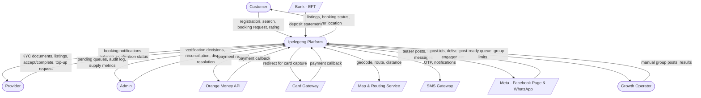
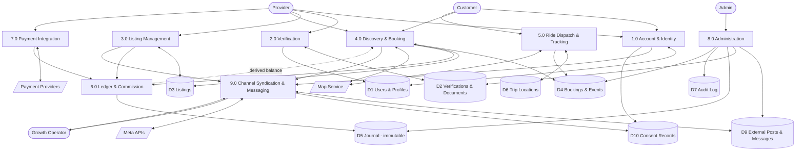
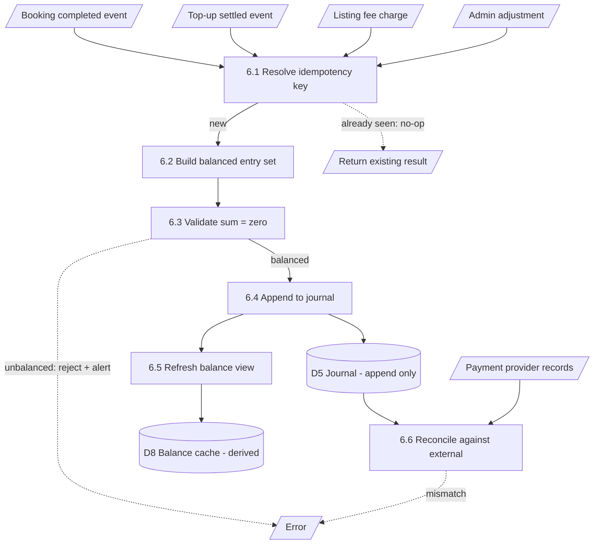
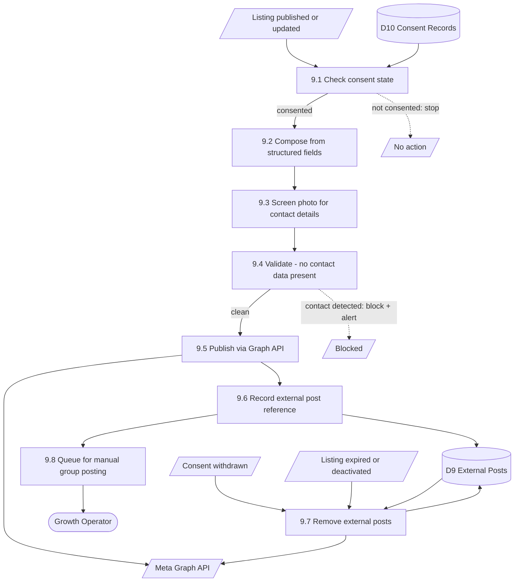

# Data flow diagrams

## Context diagram (Level 0)

The system as a single process, with its external entities.

**Note the Growth Operator.** They appear on the context diagram as an external
actor because manual group posting is outside the system boundary — the system
prepares and records the work, but a person performs it. That is a consequence
of the Groups API withdrawal, not a design preference.

---

## Level 1 — major processes

### Process descriptions

| # | Process | Inputs | Outputs | Key stores |
|---|---|---|---|---|
| 1.0 | Account & Identity | Phone, name, consent | Verified account, session | D1 |
| 2.0 | Verification | Documents, category | Approved/rejected category | D2, D1 |
| 3.0 | Listing Management | Listing details, direction, area | Published listing; fee request for rentals | D3 |
| 4.0 | Discovery & Booking | Search criteria, booking request | Listings, booking state changes | D3, D4 |
| 5.0 | Ride Dispatch & Tracking | Pickup, destination, driver positions | Assignment, live location, route | D4, D6 |
| 6.0 | Ledger & Commission | Completion events, top-up settlements, fees | Journal entries, derived balances | D5 |
| 7.0 | Payment Integration | Top-up request, provider callbacks | Settled/failed top-up | D5 |
| 8.0 | Administration | Admin decisions | Approvals, resolutions, audit entries | D2, D4, D5, D7 |
| 9.0 | Channel Syndication & Messaging | Listing published, booking events, consent state | Teaser posts, template messages, post-ready queue | D9, D10 |

**Note on 9.0.** It reads consent (D10) before every outbound action and writes
nothing to the listing or booking stores. It is deliberately a *leaf* process:
if the channel integration fails, nothing upstream is affected. A Facebook
outage must never prevent a listing going live.

**Note on 6.0.** Only process 6.0 writes to D5, and it only appends. No other
process may write journal entries directly. This single rule is what keeps the
ledger trustworthy.

---

## Level 2 — process 6.0, Ledger & Commission

**6.1 exists to make retries safe.** A payment gateway that sends the same
callback twice, a provider who taps "complete" twice, a network retry — all
resolve to the same key and post once.

**6.3 exists to make corruption loud rather than silent.** An unbalanced
transaction is rejected and alerted on, not quietly written.

**6.6 exists because internal records drift from external ones.** Scheduled
reconciliation against Orange Money and bank statements catches what callbacks
missed.

---

## Level 2 — process 9.0, Channel Syndication

**9.4 is a gate, not a filter.** If contact data is detected, the post is
blocked and flagged — it is not silently stripped and published. Silent
stripping hides a bug in the composer; blocking surfaces it.

**9.1 reads consent every time**, not once at listing creation. Consent can be
withdrawn between a listing going live and an update being syndicated.
