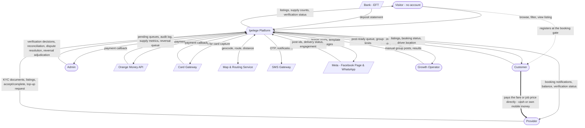
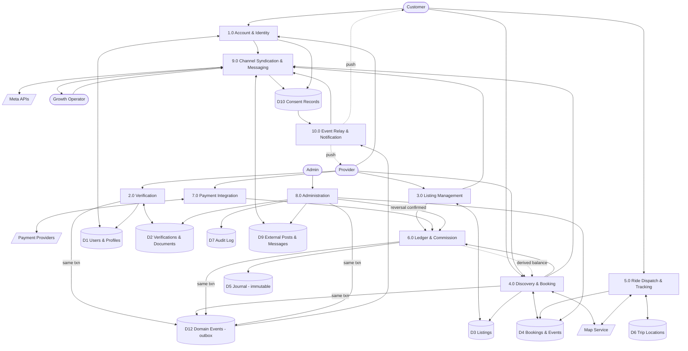
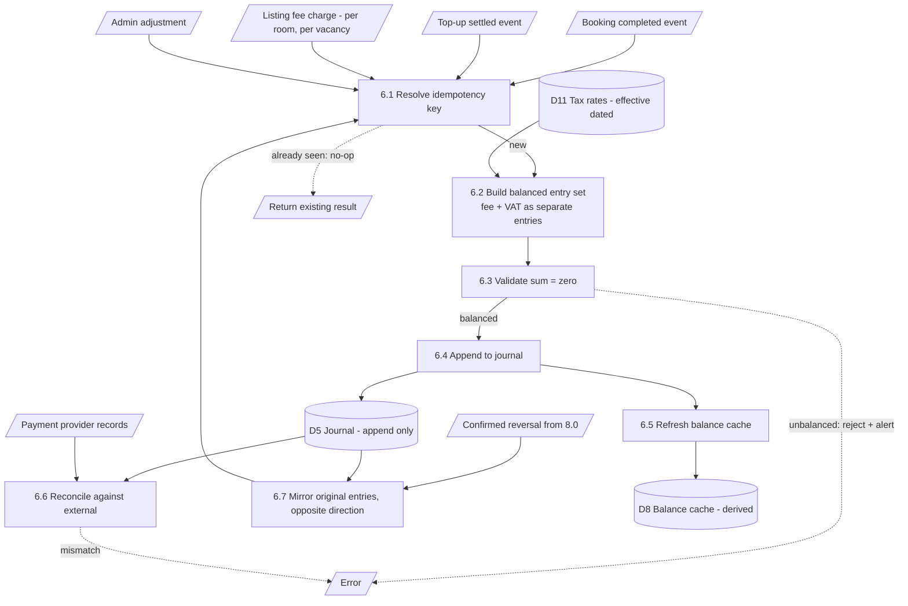

# Data flow diagrams

> Refined 2026-08-17 against the design work — see
> [design-deltas](design-deltas.md). Visitor is now a distinct external entity,
> the customer↔provider payment is drawn explicitly as a flow *outside* the
> system boundary, and reversal adjudication routes through 6.0 rather than
> writing to the journal directly.

## Context diagram (Level 0)

The system as a single process, with its external entities.

**Note the Visitor.** UC-4 grants browse rights without an account, and the
design moved the account wall from app launch to the booking action. A Visitor
is therefore a real external entity with real data flows, not a customer who has
not logged in yet. Everything they can see — supply counts, verification badges,
listing detail — is a deliberate product decision: a stranger sees the supply
before being asked for a phone number.

**Note the heavy arrow between Customer and Provider.** It is drawn on the
context diagram precisely because it does **not** touch the system. The fare and
the job price move person to person, in cash or the parties' own mobile money.
That absence is the structural choice that keeps the platform out of payment
services regulation ([compliance](compliance.md)) — drawing it makes the
boundary visible instead of leaving its omission to be read as an oversight.

**Note the Growth Operator.** They appear on the context diagram as an external
actor because manual group posting is outside the system boundary — the system
prepares and records the work, but a person performs it. That is a consequence
of the Groups API withdrawal, not a design preference.

---

## Level 1 — major processes

### Process descriptions

| #   | Process                         | Inputs                                           | Outputs                                                    | Key stores |
| --- | ------------------------------- | ------------------------------------------------ | ---------------------------------------------------------- | ---------- |
| 1.0 | Account & Identity              | Phone, name, consent                             | Verified account, session                                  | D1         |
| 2.0 | Verification                    | Documents, category                              | Approved/rejected category                                 | D2, D1     |
| 3.0 | Listing Management              | Listing details, direction, area                 | Published listing; fee request for rentals                 | D3         |
| 4.0 | Discovery & Booking             | Search criteria, booking request                 | Listings, booking state changes                            | D3, D4     |
| 5.0 | Ride Dispatch & Tracking        | Pickup, destination, driver positions            | Assignment, live location, route                           | D4, D6     |
| 6.0 | Ledger & Commission             | Completion events, top-up settlements, fees      | Journal entries, derived balances                          | D5         |
| 7.0 | Payment Integration             | Top-up request, provider callbacks               | Settled/failed top-up                                      | D5         |
| 8.0 | Administration                  | Admin decisions, reversal adjudication           | Approvals, resolutions, confirmed reversals, audit entries | D2, D4, D7 |
| 9.0 | Channel Syndication & Messaging | Listing published, booking events, consent state | Teaser posts, template messages, post-ready queue          | D9, D10    |
| 10.0 | Event Relay & Notification     | Unprocessed domain events, consent state, device registry | Push notifications, outbound message rows  | D12, D10, D9 |

**Note on 10.0 — this is the admin↔app join.** It did not exist in the original
specification, which described admin decisions and app screens without anything
connecting them. Four processes write to D12, and they write **inside the same
database transaction as the state change itself** — so an approval and its
notification cannot come apart. If the approval commits, the event commits; if
it rolls back, so does the event. See
[database](database.md#the-event-outbox--how-a-state-change-reaches-the-phone).

10.0 is a *relay*, not a source: it reads D12, checks consent in D10 at dispatch
time, writes D9 and pushes. It never writes domain state. Delivery is
**at-least-once** — the relay can crash after sending and before stamping — so
the uniqueness constraint on `(domain_event, channel, user)` is what makes a
duplicate harmless. Same technique as the ledger's idempotency key, for the same
reason.

Everything downstream of D12 is **best-effort**. Push is a hint on 1–2 GB
handsets over 3G; every affected screen must reach the correct state by refresh
alone. That is the common path, not the fallback.

**Note on 9.0.** It reads consent (D10) before every outbound action and writes
nothing to the listing or booking stores. It is deliberately a *leaf* process:
if the channel integration fails, nothing upstream is affected. A Facebook
outage must never prevent a listing going live.

**Note on 6.0.** Only process 6.0 writes to D5, and it only appends. No other
process may write journal entries directly. This single rule is what keeps the
ledger trustworthy. For the wallet end to end — one account per provider, the
three category fee shapes, refunds, and how admin actions move the balance — see
[wallet](wallet.md).

**8.0 no longer writes to D5.** It previously did, which contradicted the rule
above. A confirmed reversal is an *instruction* from Administration to Ledger &
Commission, which then posts the reversing entries through the same idempotent
path as every other posting. The correction matters because reversals are the
one money operation an admin triggers by hand — exactly the path most likely to
grow a shortcut straight into the journal. In the database this is not merely a
convention: the application role holds no `UPDATE` or `DELETE` on the journal
tables at all ([database](database.md#1-the-journal-is-append-only-enforced-by-privilege)).

---

## Level 2 — process 6.0, Ledger & Commission

**6.1 exists to make retries safe.** A payment gateway that sends the same
callback twice, a provider who taps "complete" twice, a network retry — all
resolve to the same key and post once.

**6.2 builds fee and VAT as separate entries**, never one bundled figure. The
rate comes from D11 by effective date, not from a constant — a historical
transaction has to stay reconstructable at the rate that applied on its own
date. A P120 ride at 8% produces three entries in one transaction: provider
debit 10.94, platform revenue credit 9.60, VAT payable credit 1.34.

**6.3 exists to make corruption loud rather than silent.** An unbalanced
transaction is rejected and alerted on, not quietly written.

**6.6 exists because internal records drift from external ones.** Scheduled
reconciliation against Orange Money and bank statements catches what callbacks
missed.

**6.7 is new, and it reads D5 before it writes to it.** A reversal is not a
computed credit — it is the original transaction's entries mirrored line for
line in the opposite direction, same figures, referencing the original. That
includes the VAT entry, which becomes its own credit note rather than
disappearing from the trail. Nothing about a reversal is recalculated, because
recalculating at today's rate would silently restate history.

Note what is *absent* from this diagram: there is no path from a raised or
under-review reversal to D8. **The balance does not move until the reversal is
confirmed** — the pending state is carried on the ledger view as a marker with
no amount, because an amount would imply money already returned.

---

## Level 2 — process 9.0, Channel Syndication

**9.4 is a gate, not a filter.** If contact data is detected, the post is
blocked and flagged — it is not silently stripped and published. Silent
stripping hides a bug in the composer; blocking surfaces it.

**9.1 reads consent every time**, not once at listing creation. Consent can be
withdrawn between a listing going live and an update being syndicated.
