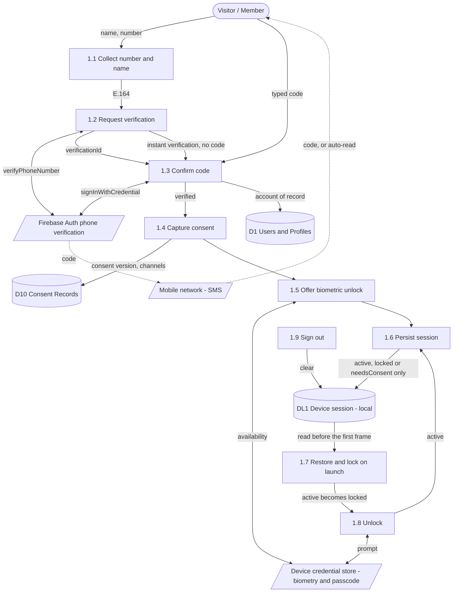
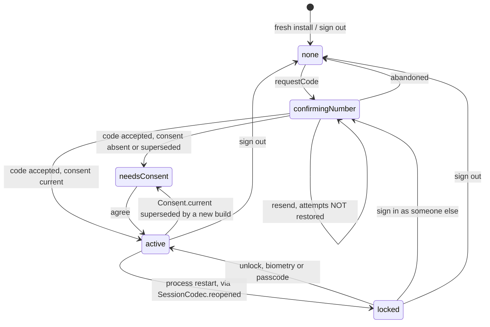
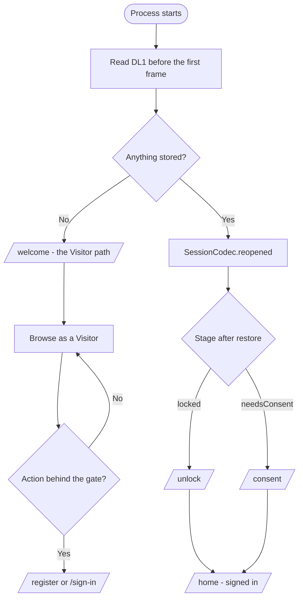

# Entry flow — account creation, sign in, reopen

**The authoritative specification for everything between "the app launches" and
"the person is signed in".** Account creation, sign in, the OTP round trip,
consent capture, biometric enrolment, reopen and unlock, sign out.

It exists because those screens were each built correctly against the canvas and
never specified *as one process*, and the gaps were exactly at the joins: a
state nothing could reach, a callback nothing handled, a launch decision nothing
made. Three bugs found on a Galaxy S24 on 2026-08-21 were all joins, not
screens. §8 records them.

This file is **normative**. Where it disagrees with a screen, the screen is
wrong. Where it disagrees with the canvas, §9 says so explicitly and
`design/CORRECTIONS.md` carries it back to the design side.

| Reference | What it covers | Relationship to this file |
|---|---|---|
| [use-cases.md](use-cases.md) | UC-1 Register account | This file is UC-1's expansion, plus the three cases UC-1 never had |
| [system-flowcharts.md](system-flowcharts.md#account-gate) | The account gate | That diagram is *where* the wall stands; §5 here is *how the machine moves* |
| [dfd.md](dfd.md) | Process 1.0 Account & Identity | §4 here is its Level 2 decomposition |
| [sms-otp.md](sms-otp.md) | What SMS costs and who sends it | This file owns the *protocol*; that one owns the *provider* |
| [device-permissions.md](device-permissions.md) | Biometry, location, notifications as OS grants | This file owns when they are asked for |
| [design-deltas.md](design-deltas.md) | Departures from the canvas | §9 entries are registered there |

---

## 1. Actors and the one thing each can do

| Actor | State on the device | May do |
|---|---|---|
| **Visitor** | No stored session | Browse, search, view listings and verification status. **Not** book, request a ride, enquire, apply, or touch the wallet |
| **Confirming** | A code has been sent, nothing signed in | Type a code, resend, abandon |
| **Consenting** | Verified, on no consent version or a superseded one | Agree, or leave. Nothing else |
| **Member** | Signed in, consent current | Everything the role allows |
| **Returning** | A session was stored and the process restarted | Unlock with the device credential, or sign in as someone else |

There is no guest checkout and no password anywhere in this app. **The phone
number is the identity and the code is the authentication** — that single
decision is why every path below converges on one OTP round.

---

## 2. Use cases

UC-1 in [use-cases.md](use-cases.md#uc-1--register-account) covers registration
only. The three cases below were always in the product and never written down,
which is why nothing implemented them.

### UC-1 · Register account (revised)

| | |
|---|---|
| **Actor** | Visitor |
| **Goal** | A usable account |
| **Precondition** | A Botswana mobile number, in a handset that can receive SMS |
| **Postcondition** | Session is `active`, consent version recorded, biometric offer spent |
| **Requirements** | FR-1.1, FR-1.2, FR-1.3, FR-1.10 |

**Main flow**

1. Visitor gives name and number on `/register`.
2. System sends a code and moves to `/verify`. **It moves only if a send
   actually happened** — a "Confirm your number" screen above a code that was
   never sent is the worst version of this failing.
3. Visitor types the code and ticks the required consent.
4. System verifies the code, creates the account, records the consent version
   and the granted channels.
5. System offers biometric unlock once, then asks for location, then lands home.

**Alternate flows**

- **2a. The number already has a session on this device** → the flow is
  identical. Register and sign in differ only in whether a name is asked for;
  see §3.
- **2b. Instant verification** — the platform verifies the SIM with no SMS at
  all. **Skip to step 4 with no code typed.** See §6.3.
- **2c. Send failed** → stay on `/register`, say which of the four reasons it
  was, and send nothing to `/verify`.
- **3a. Code not received** → resend after the timer. **A resend sends a code**;
  it does not merely restart the countdown (§6.4). It does not restore attempts.
- **3b. Code wrong** → decrement, up to `Session.maxCodeAttempts`; at zero the
  round is dead and only a fresh number revives it.
- **3c. Auto-retrieval reads the SMS** → advance as though it had been typed.
- **4a. Consent declined** → cannot proceed. The primary stays dead and says why.

### UC-1a · Sign in on a device that already knows the account

| | |
|---|---|
| **Actor** | Visitor holding a device with a remembered name and number |
| **Goal** | Re-enter an account after signing out, or on a reinstall |
| **Precondition** | The number is registered |
| **Postcondition** | Session is `active`; existing consent and channels are **unchanged** |

**Main flow**

1. `/sign-in` shows the remembered name and number. One field; no name asked.
2. Send a code → `/verify`.
3. Type it. **No consent card is drawn** when the stored consent version is
   current — consent already exists and re-asking would overwrite it (§9.2).
4. Land home. The biometric offer is **not** re-made if it has been spent.

**Alternate flows**

- **2a. Instant verification** → as UC-1 2b.
- **3a. Stored consent is superseded** → `/consent` before home, not after.

### UC-1b · Reopen a closed app

| | |
|---|---|
| **Actor** | Returning |
| **Goal** | Get back into an account without an SMS |
| **Precondition** | A session was stored and the **process** has restarted |
| **Postcondition** | Session is `active` again, or the person chose to sign in as someone else |

**Main flow**

1. The process starts. The stored session is read before the first frame.
2. A stored `active` session is restored as `locked` — **always**, whatever the
   biometric preference says (§6.5).
3. The launch decision (§5.2) routes straight to `/unlock`. The welcome screen
   is **not** shown to someone who has an account.
4. Fingerprint or device passcode reopens the same session. Neither
   authenticates; both are possession checks on a device already trusted.

**Alternate flows**

- **3a. No usable sensor** → the passcode is the primary action, not a fallback
  drawn as second best.
- **4a. Prompt cancelled** → say nothing. A cancelled prompt is a change of mind
  and the other way in is already on screen.
- **4b. "Sign in as someone else"** → `/sign-in`, a full OTP round, and the
  stored session is replaced only once the new one is verified.

**A warm resume is not a reopen.** Backgrounding and returning does not lock —
decided 2026-08-21, recorded in §9.3.

### UC-1c · Sign out

| | |
|---|---|
| **Actor** | Member |
| **Postcondition** | Nothing about the account remains on the device |

Sign out clears the store rather than writing an emptied session, so a
half-written record cannot survive it. The next entry is a full number + OTP,
and the welcome screen is shown again because there is now nothing to return to.

---

## 3. Register and sign in are one process

They differ in exactly one field. Everything after the number is identical, and
both write through `SessionController.requestCode`.

| | `/register` | `/sign-in` |
|---|---|---|
| Asks for a name | Yes | No — shows the remembered one |
| Sends a code | Yes | Yes |
| Next route | `/verify` | `/verify` |
| Consent captured | Yes | Only if absent or superseded |

**This is a standard, not an observation.** A second code path for "returning
user" is how the two drift, and the reason the app cannot have one is that the
sender cannot tell them apart either: an OTP to a known number and an OTP to an
unknown one are the same message.

---

## 4. Data flow — Level 2 of process 1.0

`D1` and `D10` are the server stores from
[dfd.md](dfd.md#level-1--major-processes). `DL1` is new here and is **on the
handset**: `SharedPreferences`, one key, written by `PrefsSessionStore`.

**What this diagram is for is the two edges people get wrong.**

- `P12 → P13` has **two** arrows. The second one — instant verification — has no
  SMS, no `verificationId` and no typed code, and it is the path that broke
  (§8.1). A decomposition that draws only the first will grow the same bug back.
- `P16 → DL1` is deliberately narrow. Only `active`, `locked` and `needsConsent`
  are ever written; a mid-verification session is not (§6.6).

**Firebase is a sender, not the identity.** `FirebaseOtpVerifier` throws the
Firebase user away and reports only whether the code was right, which is why
there is no arrow from `FB` to `D1`. See [architecture.md](architecture.md),
"Why not Firebase".

---

## 5. The state machine

### 5.1 Stages, and every transition between them

`confirmingNumber` also carries a **dead end**: at zero attempts `codeLocked` is
true and the only exit is a fresh number. That is a property of the round, not
of the account, which is why it is a counter and not a stage.

### 5.2 The launch decision

One decision, made once, before anything is drawn. It belongs in the router's
redirect and not in a screen's `initState`, because a screen that decides where
to go can be reached by another route that skips the decision.

**A returning user never sees `/welcome`.** It is a marketing screen with "Get
started" and "Sign in" on it, and showing it to someone who already has an
account is what made a reopen cost an SMS (§8.3).

The store read is synchronous by then — `SharedPreferences.getInstance()` is
awaited in `main()` before `runApp` — which is what lets the app open straight
onto the right screen instead of flashing the welcome screen and correcting
itself.

---

## 6. The OTP protocol

### 6.1 The seam

`OtpVerifier` in `core/session.dart` is the interface; `FirebaseOtpVerifier` in
`core/otp_firebase.dart` is the only implementation that costs money;
`DemoOtpVerifier` is the default, so a widget test never touches a network.

The session's state machine owns the rules — unskippable, attempt-limited, a
resend does not restore attempts — and must not know what a
`FirebaseAuthException` is.

### 6.2 Every provider callback maps to exactly one outcome

**This table is the contract.** `verifyPhoneNumber` reports through callbacks
rather than by returning, so any callback with no row here is a hang, not an
error — which is precisely how §8.1 happened.

| Provider callback | Fires when | Outcome | The screen then |
|---|---|---|---|
| `codeSent` | An SMS is on its way | `sent` | Goes to `/verify`, starts the countdown |
| `verificationCompleted` **before** `codeSent` | The platform verified the SIM without sending anything | `autoVerified` | Skips `/verify` entirely; treats it as a passed code |
| `verificationCompleted` **after** `codeSent` | Android read the SMS itself | round already resolved; a broadcast on `autoVerifications` | `/verify` advances on its own, nothing typed |
| `verificationFailed` | The provider refused | `invalidNumber` \| `tooManyRequests` \| `unavailable` | Stays put and names the reason |
| `codeAutoRetrievalTimeout` | The shortcut gave up | none — **not a failure** | Nothing. The code is still valid and still typeable |

Two callbacks can fire in one round, so resolving the round twice is normal and
must not throw.

**Every branch logs its own words before collapsing them.** Four enum values are
right for a screen and useless for diagnosis, and both outcomes are logged, not
only the failure — logging one side leaves "it worked" and "nothing was
attempted" looking identical from the outside.

### 6.3 Instant verification is a pass, not a shortcut to be ignored

**Decided 2026-08-21.** When the platform verifies without an SMS, the person is
in. No code screen is shown.

"Every fresh login goes through OTP" means **there is no password**, not that a
message must be billed on every entry. The check instant verification performs
is the same possession check the SMS performs, done by the platform against the
SIM in the handset; refusing it would send a message to prove something already
proved, and pay for it.

For a **new** account this still cannot skip consent: verification lands on
`needsConsent`, and `/consent` comes before home. Consent is captured at account
creation either way — FR-1.10 is satisfied by the state machine, not by the code
screen happening to carry a checkbox.

### 6.4 Resend

The button sends a code. It reuses the round's resend token so the network sees
a resend rather than a fresh attempt, restarts the countdown, and **does not**
restore attempts — the limit is on guessing, and a resend that reset it would
make it decorative.

### 6.5 A reopen never re-authenticates

A restored `active` session becomes `locked`, whatever `biometricUnlock` says.

The rule used to branch, and the reason it no longer does is not cost: **an SMS
code proves possession of the SIM, and on a reopen the SIM is inside the handset
the person is holding.** Against the one threat this exists to stop — a stolen
phone — the code arrives in the thief's hand along with everything else. The
device credential is the thing a thief does not have. `biometricUnlock` decides
what `/unlock` *offers first*, which is what the preference was always about.

### 6.6 What is stored, and what is not

| Kept | Dropped |
|---|---|
| Stage (`active`, `locked` or `needsConsent`), name, number | Any `none` or `confirmingNumber` session |
| Consent version and granted channels | Any OTP already sent, and its `verificationId` |
| Location grant, biometric offer and answer | `codeAttemptsLeft` — a property of one round |

Resuming into a form whose code has expired is worse than starting the round
again, which is why a mid-verification session is not worth keeping.

---

## 7. Standards — the invariants, and what pins each one

Each row is a rule the entry flow must not break, and the test that fails if it
does. **A rule with no test in the right-hand column is a comment.**

| # | Invariant | Pinned by |
|---|---|---|
| S-1 | Every provider callback resolves the round. No path leaves `send()` unresolved | `test/core/otp_firebase_test.dart` |
| S-2 | A screen advances to `/verify` only after a send actually happened | `test/ui/entry_flow_test.dart` |
| S-3 | Instant verification lands signed in, or on `/consent` when consent is absent | `test/ui/entry_flow_test.dart` |
| S-4 | A restored `active` session is `locked`, never `active` | `test/core/session_store_test.dart` |
| S-5 | Launch with a stored session never shows `/welcome` | `test/routing/launch_test.dart` |
| S-6 | `/unlock` is reachable from a real launch, not only from `initialLocation` | `test/routing/launch_test.dart` |
| S-7 | Signing in does not overwrite existing consent or channel grants | `test/ui/entry_flow_test.dart` |
| S-8 | A resend sends. The countdown restarting is a side effect, not the action | `test/ui/entry_flow_test.dart` |
| S-9 | A resend does not restore attempts | `test/core/session_test.dart` |
| S-10 | The biometric offer is made once and never re-made | `test/core/session_test.dart` |
| S-11 | Sign out clears the store rather than writing an empty session | `test/core/session_store_test.dart` |
| S-12 | The code length is one constant, and the screen draws that many boxes | `test/ui/verify_test.dart` |
| S-13 | Back cannot re-enter a flow that would send a second code | `test/routing/navigation_test.dart` |

---

## 8. The three defects this specification closes

Found on a Galaxy S24, 2026-08-21. **All three are joins between correct
screens**, which is the argument for this file existing.

### 8.1 Cannot sign in a second time

`verificationCompleted` completed nothing. On a repeat sign-in Firebase
instant-verifies the SIM and fires that callback *instead of* `codeSent`, so
`send()` never returned and the button sat on "Sending…" forever. Had it
returned, `_verificationId` was still null, so no typed code could have been
correct either.

**The shape of the bug:** a callback interface with an unhandled branch does not
fail, it hangs. §6.2 is the exhaustive table that replaces "handle the ones we
have seen".

### 8.2 Biometric unlock never engages

Nothing in `lib/` navigated to `Routes.unlock`, and nothing in `lib/` called
`SessionController.lock()` either — both were reached only from tests. The screen was reachable only by a test passing `initialLocation`,
which is why it had passing tests and no working path — **a test that constructs
the state it is testing cannot tell you the state is reachable.**

### 8.3 A reopen falls back to SMS, then to too-many-requests

The welcome screen made no launch decision, so a restored session landed on "Get
started / Sign in" and the only way forward was another SMS. Repeat that a few
times and Firebase throttles the number, which is the `too-many-requests` the
handset showed. §5.2 is the decision that was missing.

---

## 9. Departures from the canvas

Registered in [design-deltas.md](design-deltas.md) and raised in
`design/CORRECTIONS.md`.

1. **Six code boxes, not four.** Firebase sends six digits and the length is not
   configurable, so a four-box screen cannot accept the code that arrives.
   Forced, not chosen.
2. **No consent card on a returning sign-in.** The artboard draws it on every
   verification. Drawing it for a member whose consent is current means an
   unticked box silently withdraws a granted channel, so the card appears only
   when consent is absent or superseded.
3. **A warm resume does not lock.** Decided 2026-08-21: only a process restart
   locks. A fingerprint prompt every time someone checks a notification is the
   most common reason people turn biometrics off, and a backgrounded app is
   already behind the OS's own lock screen.
4. **`/welcome` is skipped for a returning user.** The canvas shows the splash
   ahead of the launch branch. The Android system splash already covers the
   moment before the first frame, so the Flutter welcome screen is a marketing
   screen, and a member should not meet one.

---

## 10. Open

- **Account recovery when the number is gone.** The number is the identity, so
  losing the SIM currently loses the account. Every option — a second factor, a
  support-desk path, a recovery contact — has a fraud shape, and none is chosen.
- **Multi-device.** One session per device is assumed throughout. Whether
  signing in on a second handset should end the first is undecided.
- **Rate limiting on our side.** Firebase's per-number throttle is the only
  limiter today and its threshold is not published. When an aggregator replaces
  it ([sms-otp.md](sms-otp.md#move-to-a-sadc-aggregator-when-volume-justifies-it))
  the limit becomes ours to set.
- **What `/unlock` does after repeated failures.** The OS owns the lockout for
  its own credential; whether the app should add one on top is unanswered.
