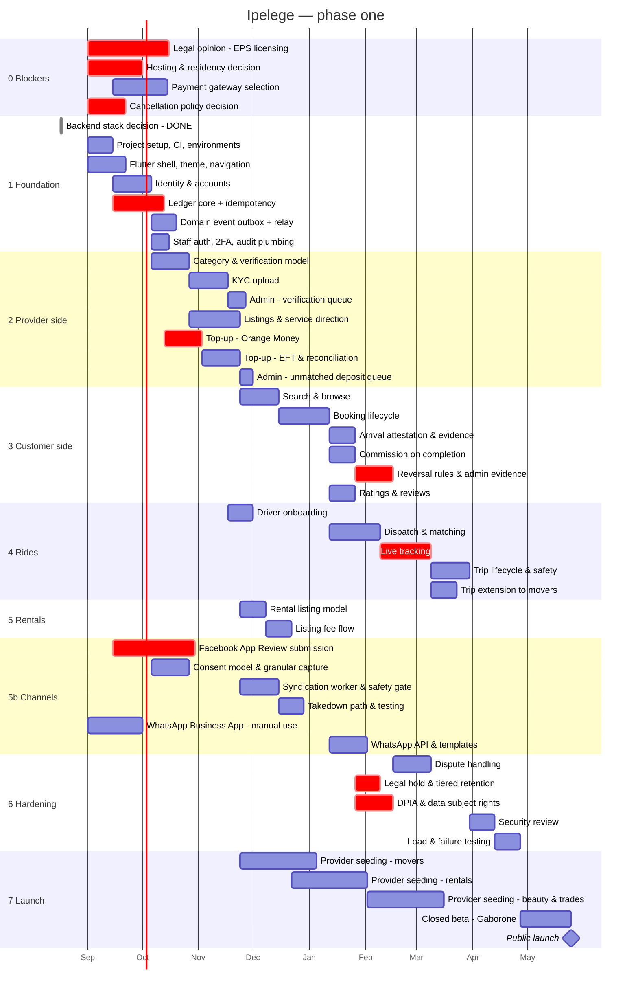
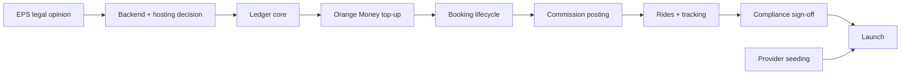

# Project plan

## Health warning on this plan

This is a **structure**, not a commitment. Two things could invalidate it
entirely:

1. **The EPS licensing question.** If the Bank of Botswana requires a licence
   for the wallet ([compliance](compliance.md)), the timeline below does not
   survive — licensing involves incorporation, capital, security vetting of
   directors and a formal business plan. That is quarters, not weeks. **Resolve
   this before committing to any date.**
2. **Team size.** The durations assume a small team working steadily. One person
   part-time should roughly double them.

**Nine** launch categories is a lot of surface area — the design split the old
"Small trades" grouping into Plumbing, Electrical and Tiling, each with its own
KYC requirements, and separated Catering from Hire
([design-deltas](design-deltas.md#1-nine-categories-not-six)). The single
biggest schedule risk after licensing is trying to build all nine to the same
depth at once. Categories are data, not code — build the model once, seed two or
three deeply.

## Phases

## Milestones

| # | Milestone | Definition of done |
|---|---|---|
| M0 | Licensing position known | Written legal opinion on the wallet model |
| M1 | Ledger provably correct | Concurrent double-post test passes; balances reconstruct from journal |
| M2 | First real top-up | Orange Money end-to-end in production, reconciled |
| M3 | First real booking | Non-ride booking completed, commission posted correctly |
| M4 | First real trip | Ride completed with tracking, route recorded |
| M5 | Supply threshold met | Minimum provider count reached per category per city |
| M5b | Channel loop working | Listing syndicates to Page, deep link converts to install, takedown verified |
| M6 | Compliance sign-off | DPIA complete, data subject rights functional, residency satisfied |
| M7 | Public launch | M1–M6 all met |

**M5 is the one that will slip.** It depends on people signing up, not on code
being finished, and it is the least controllable item in the plan.

## Critical path

Everything financial sits behind the ledger. Everything sits behind the legal
opinion. Provider seeding runs in parallel and joins at the end — start it as
early as there is something to show.

## Sequencing advice

**Build the ledger first, before any feature that touches it.** It is the piece
where mistakes are least recoverable — a booking bug loses a booking, a ledger
bug loses trust and cannot be cleanly undone.

**The admin side is not a phase-two panel.** Five mobile journeys cannot
complete without a human on the other side — KYC approval, EFT matching,
reversal adjudication, dispute resolution, revocation. Admin capability
therefore lands *with* the feature it unblocks rather than in a lump at the end,
which is why it now appears in three sections of the Gantt instead of as a
single "admin panel skeleton" bar. Because the back office is Django admin
inside the same project, each of those bars is short. See [admin](admin.md).

**Instrument evidence before you need to adjudicate on it.** Arrival
attestation is scheduled immediately after the booking lifecycle and before
reversal rules, deliberately: seven of the nine categories currently produce no
evidence that a service happened, and a reversal queue with nothing to weigh is
a queue that decides by coin toss. Retrofitting attestation after bookings are
live means every historical dispute is unadjudicable. See
[cancellation](cancellation.md).

**Consider narrowing the launch.** Six categories at launch is the stated
decision, and the ecosystem argument for it is sound. But a defensible middle
path is to build the full six-category *model* — categories are data, not code —
while seeding only two or three deeply for the closed beta, then opening the
rest as supply arrives. That keeps the ecosystem architecture without six
half-empty categories on day one.

## Note on Facebook App Review

`pages_manage_posts` requires Meta App Review, which has a lead time outside
your control. It is marked critical in the Gantt for that reason — not because
it is hard, but because it cannot be compressed once you are late. **Submit
early**, even before the syndication worker is finished.

Manual group posting and the WhatsApp Business App need no approval at all and
can start immediately — they are how seeding actually begins.

## Not estimated here

- Marketing and provider acquisition cost
- Legal and licensing fees
- App store review time
- Support staffing for EFT reconciliation, which scales with provider count
- **Growth operator time for manual group posting** — a recurring staffed role,
  roughly 3–5 groups per day, not an automated feature
- WhatsApp per-message costs once past the free service window
