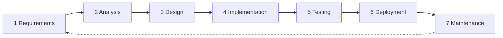

# SDLC overview

How this documentation set maps to software development life cycle phases, and
what state each phase is in.

| Phase | Documents | Status |
|---|---|---|
| **1 Requirements** | [problem-statement](problem-statement.md), [solution](solution.md), [requirements](requirements.md) | Complete enough to build from |
| **2 Analysis** | [categories](categories.md), [monetization](monetization.md), [go-to-market](go-to-market.md), [compliance](compliance.md), [comparable-platforms](comparable-platforms.md) | Complete; research contradicts some launch decisions |
| **3 Design — system** | [use-cases](use-cases.md), [data-model](data-model.md), [activity-diagrams](activity-diagrams.md), [dfd](dfd.md), [system-flowcharts](system-flowcharts.md), [architecture](architecture.md), [booking](booking.md), [distribution](distribution.md) | Substantially complete; dispute flow outstanding |
| **3 Design — UI** | [design-system](design-system.md), [design-deltas](design-deltas.md), archive in [`design/`](../design/) | Complete for the happy path in light and dark; some state variants still gaps |
| **3 Design — data** | [database](database.md) | Physical schema specified; four schema decisions still open |
| **3 Design — back office** | [admin](admin.md) | Complete |
| **3 Design — adjudication** | [cancellation](cancellation.md) | Mechanism specified and benchmarked; the policy itself is undecided |
| **3 Design — safety** | [safety](safety.md) | Specified and benchmarked. **One decision blocks launch:** what the verified badge actually stands behind. |
| **4 Implementation** | [project-plan](project-plan.md), [components](components.md) | Not started; stack and adopt/build decisions made |
| **5 Testing** | [test-strategy](test-strategy.md) | Written; nothing to run it against yet |
| **6 Deployment** | Blocked on hosting/residency decision | Not started |
| **7 Maintenance** | — | — |

## Reading order

**To understand the business:** problem-statement → solution → categories →
monetization → go-to-market → comparable-platforms

**To build the backend:** requirements → use-cases → data-model → **database** →
system-flowcharts → architecture → **admin** → compliance → distribution

**To build the app:** **design-system** → **design-deltas** → use-cases →
activity-diagrams → system-flowcharts → booking

**To plan it:** project-plan → open-questions

**To test it:** test-strategy

## The design ran ahead of these documents

The UI work was built *from* this specification set and then moved past it —
naming figures the docs left open, splitting categories the docs had grouped,
adding states and whole screens nothing here described. Those differences are
recorded in [design-deltas](design-deltas.md) rather than silently applied,
because several touch compliance and the ledger and need a real sign-off.

**Where the two disagree, the design is the newer decision.** The most
consequential ones: nine categories rather than six, an `AWAITING_PAYMENT`
booking state, a reversal machine that did not exist, and the balance being
called a *wallet* in the product against an explicit compliance rule not to.

## Diagram conventions

All diagrams are Mermaid, rendered natively by GitHub. Editing them means
editing text, not regenerating images — diffs stay readable and diagrams cannot
drift out of sync with the repo.

| Diagram type | Where |
|---|---|
| Use case | [use-cases](use-cases.md) — includes channel syndication and messaging |
| ER | [data-model](data-model.md) |
| Activity | [activity-diagrams](activity-diagrams.md) |
| Data flow (context, L1, L2) | [dfd](dfd.md) |
| State machine | [system-flowcharts](system-flowcharts.md) |
| System flowchart | [system-flowcharts](system-flowcharts.md) |
| Architecture | [architecture](architecture.md) |
| Gantt | [project-plan](project-plan.md) |

## What is deliberately not here

- **API specification.** Generated from the implementation (OpenAPI), not
  hand-written ahead of it. What is versioned and reviewed is the generated
  schema's diff — see [test-strategy](test-strategy.md#api-contract).
- **A separate admin panel design.** The back office is Django admin inside the
  same project, not a second application — reasoning in [admin](admin.md).
- **Financial projections.** Ride commission is now set at 8% and VAT at 14%
  ([design-deltas](design-deltas.md#2-money-figures-the-specs-left-unset)), but
  rental listing price and minimum top-up are not, so a model would still be
  guesswork.
- **Infrastructure-as-code and runbooks.** Blocked behind the hosting decision;
  writing them against an unknown provider would be wasted.

## Before implementation starts

Two external items remain, and both have real lead times:

1. **EPS licensing position** — could invalidate the wallet design entirely, and
   the design's choice to call the balance a "wallet" in the product makes this
   sharper, not softer
2. **Data residency and hosting** — determines infrastructure, and constrains
   the `identity` schema more than anything else in [database](database.md)

Neither is blocked by any design work remaining. Start them now.

**Backend stack is no longer on this list** — decided 2026-08-17 as Django 5 +
DRF + GeoDjango on PostgreSQL 16 + PostGIS
([architecture](architecture.md#backend--decided)).

## Documents still missing

Named here so the gaps are visible rather than discovered late:

| Document | Why it is needed | Blocked by |
|---|---|---|
| Dispute & cancellation **policy** | [cancellation](cancellation.md) specifies the mechanism and benchmarks the thresholds, but who may raise a reversal, within what window, and which causes qualify are undecided | A product and legal decision, nothing else |
| Retention schedule | [database](database.md#retention-schedule) has the columns and jobs; the periods are unset | Legal input |
| DPIA | Live GPS tracking is high-risk processing under the DPA | Nothing — can start now |
| Provider terms, incl. balance-at-closure policy | [compliance](compliance.md) names cash refunds as the single change most likely to reclassify the product | Counsel |
| Operations runbook | Who staffs the [admin queues](admin.md#queues--the-actual-daily-work) and to what SLA — the app copy has to name the verification review window | Staffing decision |
| Infrastructure & deployment | | Hosting decision |
