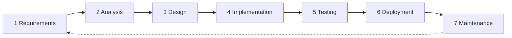

# SDLC overview

How this documentation set maps to software development life cycle phases, and
what state each phase is in.

| Phase | Documents | Status |
|---|---|---|
| **1 Requirements** | [problem-statement](problem-statement.md), [solution](solution.md), [requirements](requirements.md) | Complete enough to build from |
| **2 Analysis** | [categories](categories.md), [monetization](monetization.md), [go-to-market](go-to-market.md), [compliance](compliance.md), [comparable-platforms](comparable-platforms.md) | Complete; research contradicts some launch decisions |
| **3 Design** | [use-cases](use-cases.md), [data-model](data-model.md), [activity-diagrams](activity-diagrams.md), [dfd](dfd.md), [system-flowcharts](system-flowcharts.md), [architecture](architecture.md), [booking](booking.md), [distribution](distribution.md) | Substantially complete; backend stack and dispute flow outstanding |
| **4 Implementation** | [project-plan](project-plan.md) | Not started |
| **5 Testing** | Test strategy — **not yet written** | Not started |
| **6 Deployment** | Blocked on hosting/residency decision | Not started |
| **7 Maintenance** | — | — |

## Reading order

**To understand the business:** problem-statement → solution → categories →
monetization → go-to-market → comparable-platforms

**To build it:** requirements → use-cases → data-model → system-flowcharts →
architecture → compliance → distribution

**To plan it:** project-plan → open-questions

## Diagram conventions

All diagrams are Mermaid, rendered natively by GitHub. Editing them means
editing text, not regenerating images — diffs stay readable and diagrams cannot
drift out of sync with the repo.

| Diagram type | Where |
|---|---|
| Use case | [use-cases](use-cases.md) — includes channel syndication and messaging |
| ER | [data-model](data-model.md) |
| Activity | [activity-diagrams](activity-diagrams.md) |
| Data flow (context, L1, L2) | [dfd](dfd.md) |
| State machine | [system-flowcharts](system-flowcharts.md) |
| System flowchart | [system-flowcharts](system-flowcharts.md) |
| Architecture | [architecture](architecture.md) |
| Gantt | [project-plan](project-plan.md) |

## What is deliberately not here

- **Test strategy.** The next document to write. Ledger correctness and booking
  state transitions need property-based and concurrency tests, not just unit
  tests.
- **API specification.** Should be generated from the implementation
  (OpenAPI), not hand-written ahead of it.
- **UI designs.** Separate from this specification.
- **Financial projections.** Commission rate is not set, so any model would be
  guesswork.

## Before implementation starts

Three things should be resolved, in this order:

1. **EPS licensing position** — could invalidate the wallet design entirely
2. **Data residency and hosting** — determines infrastructure
3. **Backend stack** — everything else follows

Items 1 and 2 are external dependencies with real lead times. Start them now;
they are not blocked by any design work remaining.
