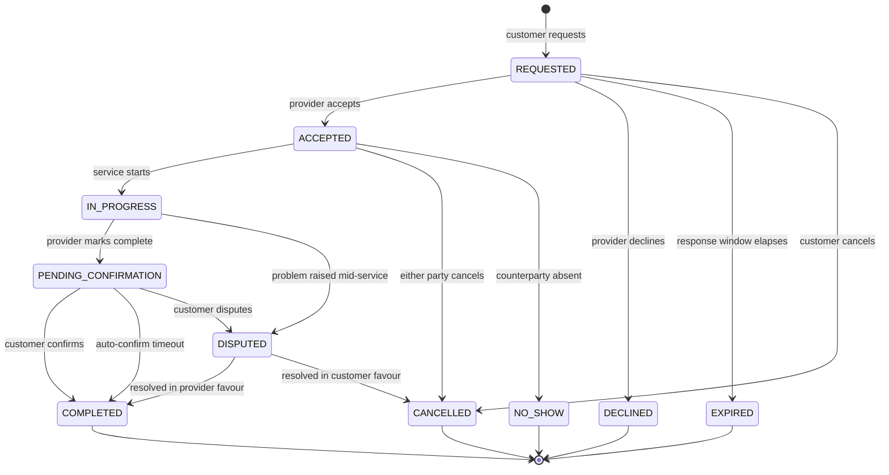
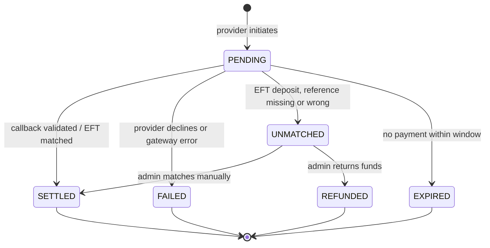
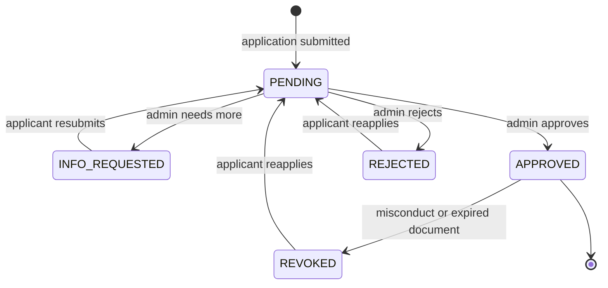
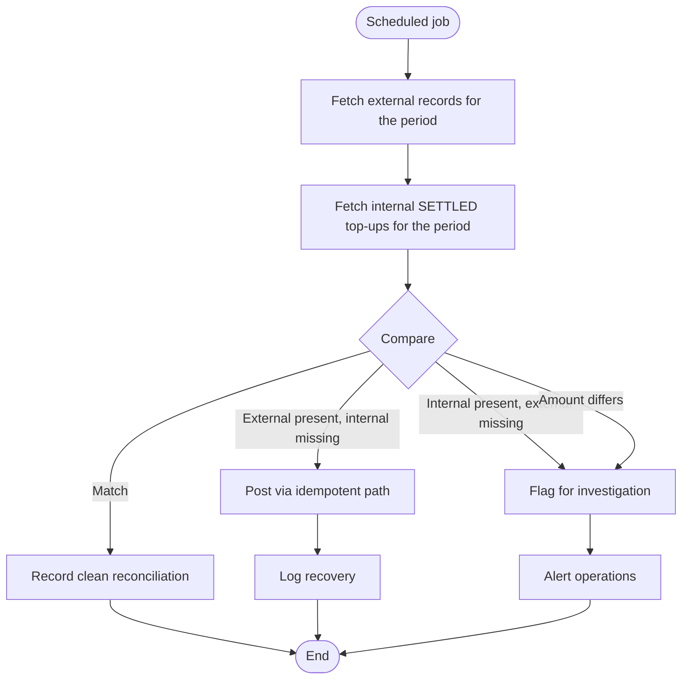
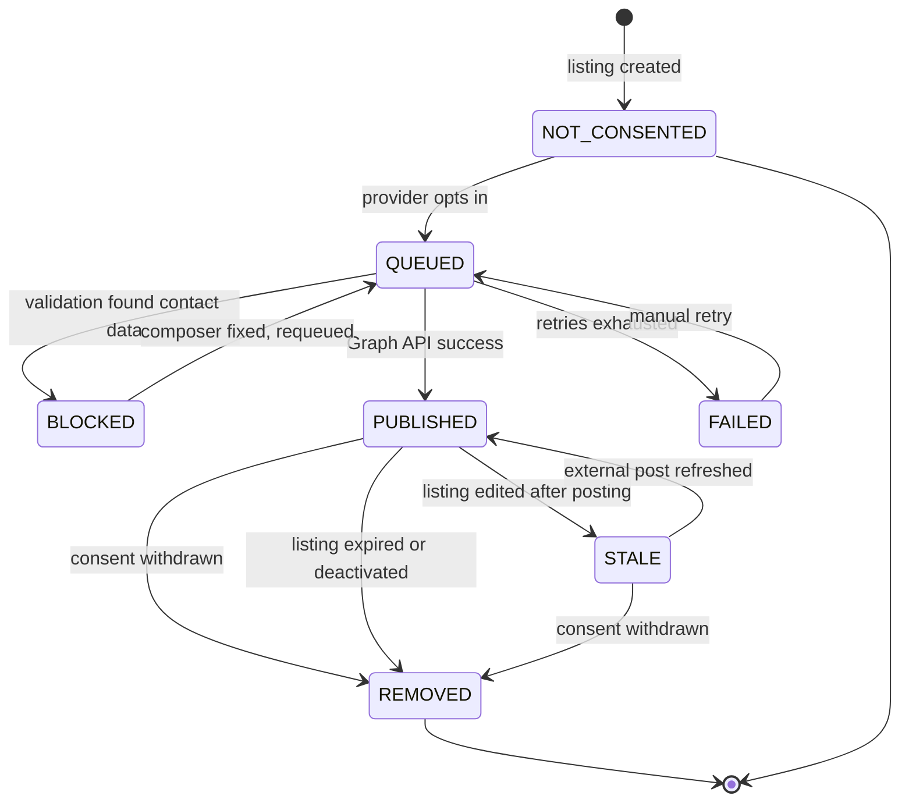
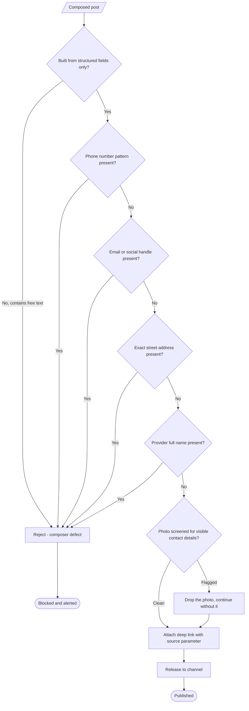

# System flowcharts & state machines

Where [activity diagrams](activity-diagrams.md) show what people do, this
document defines what the *system* must enforce.

---

## Booking state machine

Every booking is in exactly one state. Transitions not drawn here are invalid
and must be rejected by the API, not merely hidden in the UI.

### Commission posting rule

| State | Commission |
|---|---|
| COMPLETED | **Posted** |
| DISPUTED | **Held** — not posted until resolved |
| CANCELLED, DECLINED, EXPIRED, NO_SHOW | Not posted |

Commission posts **once**, on entry to COMPLETED, keyed idempotently on booking
ID. A booking that reaches COMPLETED via dispute resolution posts at that point,
not before.

> **Unresolved.** NO_SHOW currently posts nothing, which means a driver who
> waited twenty minutes absorbs the loss. Whether a no-show fee applies — and
> who bears it, given the platform never touches the customer's money — is
> [open](open-questions.md). It is a real fairness problem, not an edge case.

---

## Top-up state machine

Only the transition into SETTLED writes to the journal.

---

## Provider category verification states

**On REVOKED:** all listings under that category are deactivated immediately,
and bookings already ACCEPTED must be handled explicitly — currently undefined.

---

## Idempotent ledger posting

The single most important flowchart in the system. Any path that writes to the
journal goes through this.

**Why the check appears twice (B and I).** B is the fast path. I is the
correctness guarantee — two concurrent requests can both pass B, and only the
database unique constraint reliably stops the second from writing. Application
logic alone is not sufficient here.

---

## Payment callback handling

Providers retry callbacks. Networks duplicate them. Attackers forge them. Every
branch above exists because one of those three happens in production.

---

## Scheduled reconciliation

This job is what catches the top-up whose callback never arrived. Without it,
a provider pays and their balance silently never moves — which is the failure
most likely to lose you a provider permanently.

---

## External post state machine

`STALE` exists because a listing can change after it has been syndicated. The
`content_hash` on `EXTERNAL_POST` is what detects it.

`BLOCKED` is a **loud** state. It means the composer produced content containing
contact details, which should be impossible if posts are built from structured
fields — so it indicates a bug, and should alert rather than sit in a queue.

---

## Outbound content safety gate

Every piece of content leaving the platform for a public channel passes through
this. No exceptions, no bypass path.

**Why block rather than strip.** Silently removing a detected phone number would
publish the post and hide the fact that the composer allowed free text through.
Blocking makes the defect visible. The cost of a blocked post is one missed
post; the cost of a silent strip is a class of bug that never gets found.

**Botswana number patterns** need explicit handling — local formats, +267
prefixed, and spaced or dashed variants. Generic international regexes will miss
them.

---

## Consent gate for outbound messaging

**Consent is read at action time, never cached at listing creation.** A provider
can withdraw between publishing a listing and an update being syndicated, and
the second action must respect the newer state.

**Note the absence of a fallback at D.** If a user has not consented to
WhatsApp, the answer is not "send it by SMS instead" unless they consented to
that separately. Channel consents are granular and independent.
