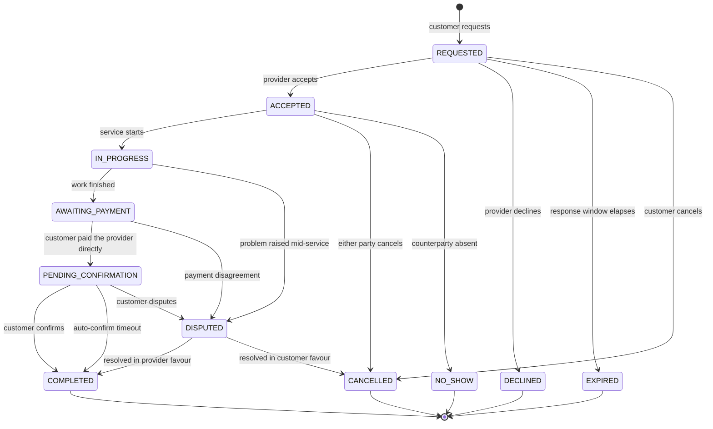
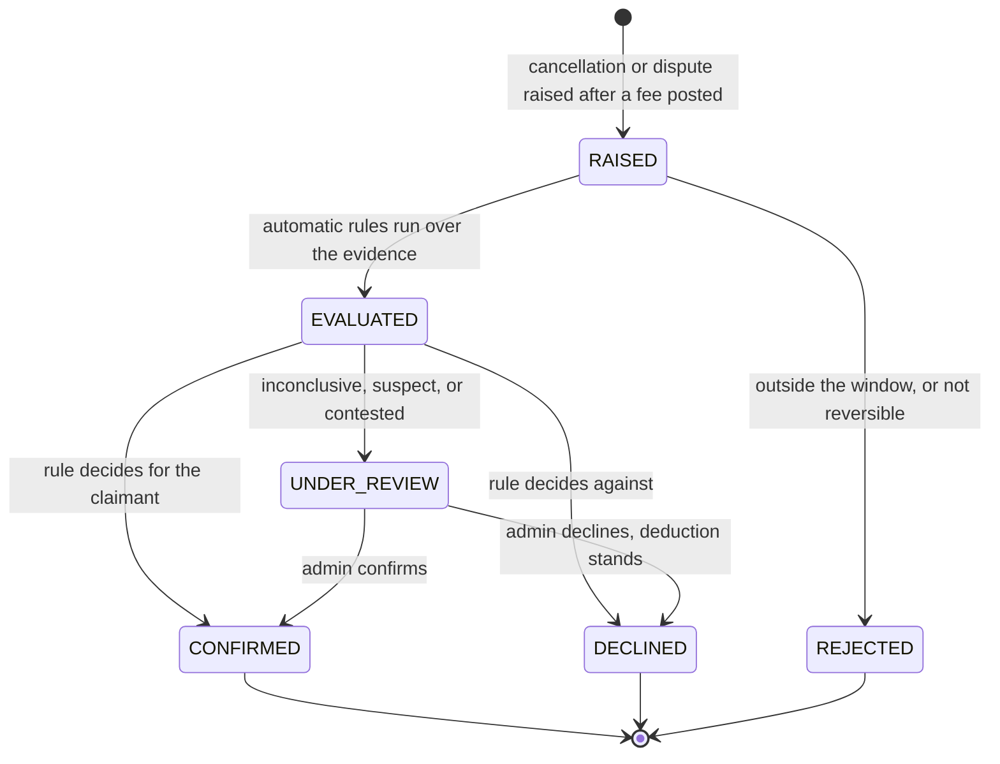
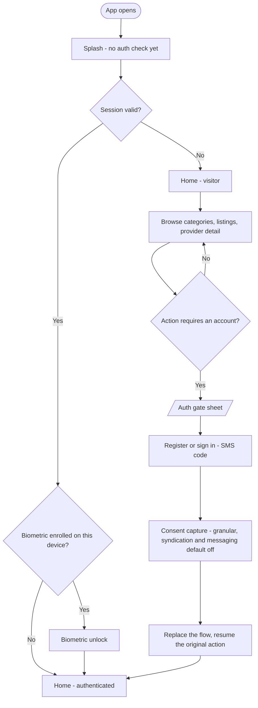
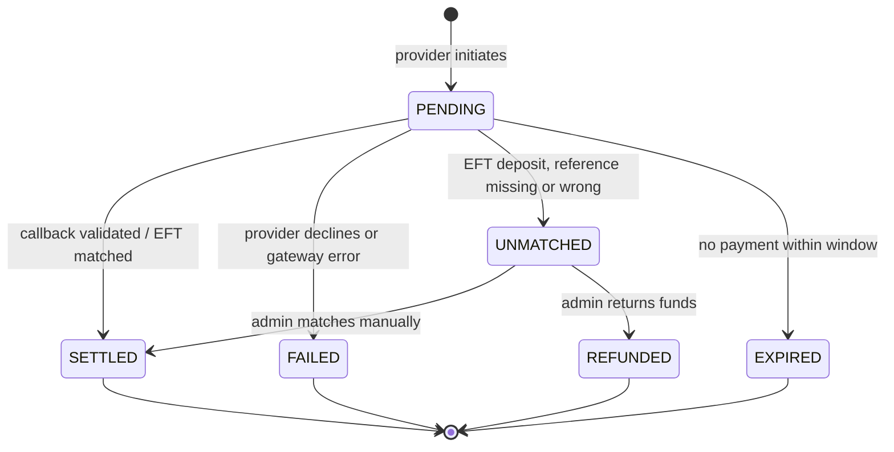
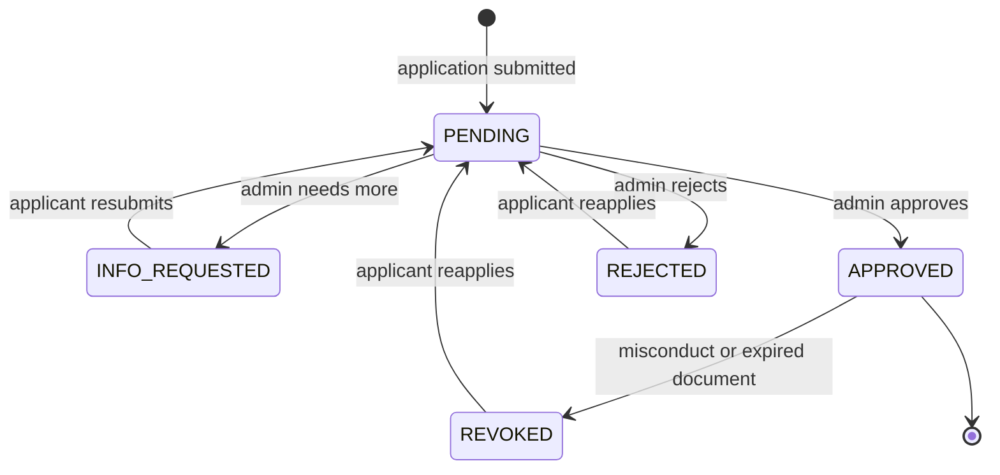
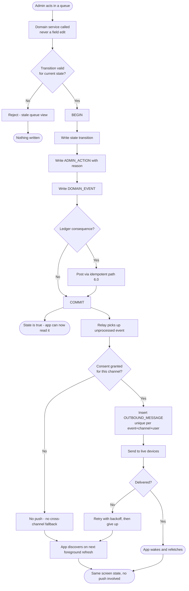
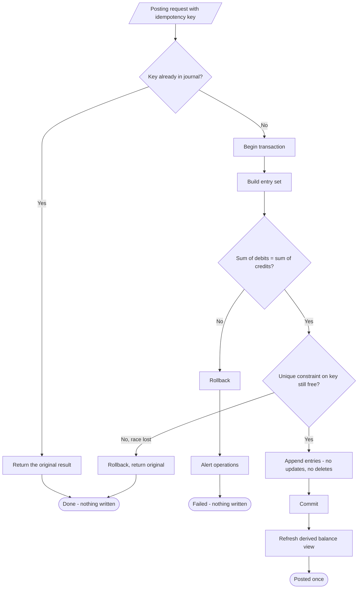
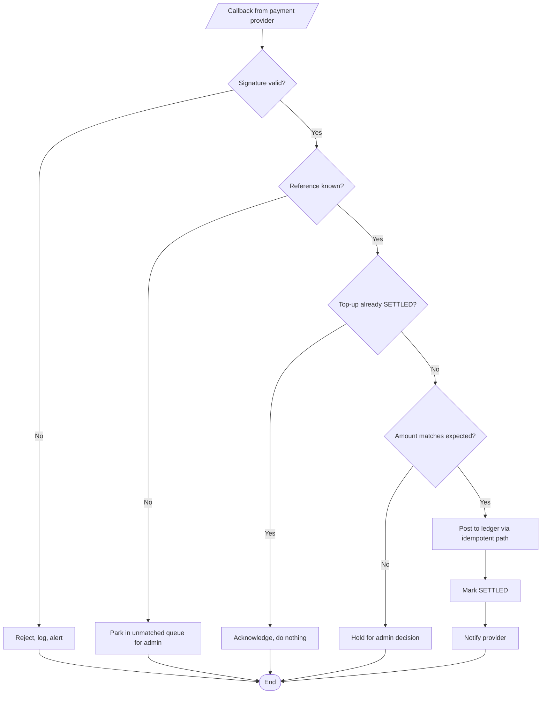
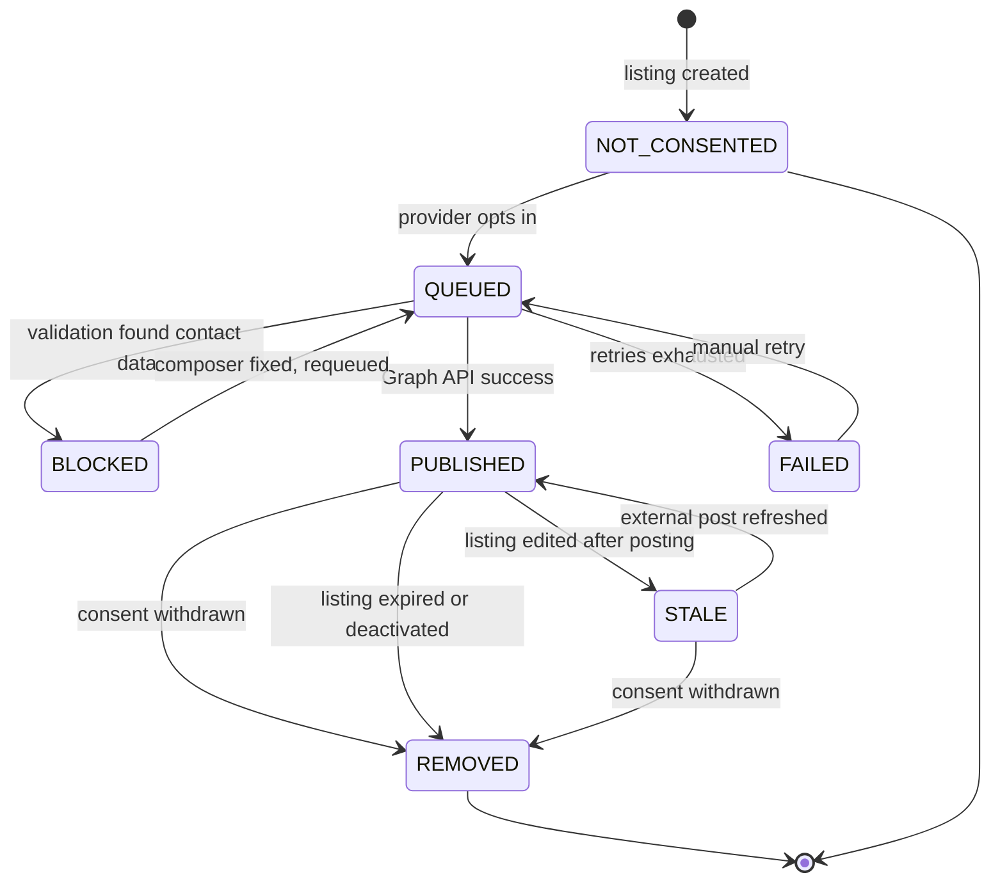
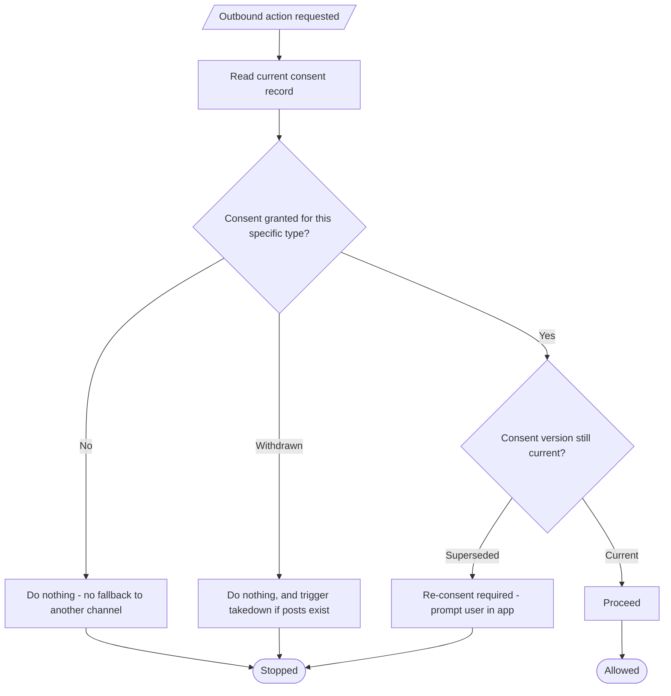

# System flowcharts & state machines

Where [activity diagrams](activity-diagrams.md) show what people do, this
document defines what the *system* must enforce.

> Refined 2026-08-17 against the design work — see
> [design-deltas](design-deltas.md). The booking machine gained
> `AWAITING_PAYMENT`, the reversal machine below is new, and the auth gate was
> moved off app launch.

---

## Not every category traverses these machines

The journey has **three shapes**, not one
([design-deltas](design-deltas.md#6-the-journey-has-three-shapes-not-one)), and
the booking machine below does not apply uniformly:

| Shape | Categories | Booking machine |
|---|---|---|
| Browse & book | Movers · Beauty · Plumbing · Electrical · Tiling · Catering · Hire | Full traversal |
| Dispatch | Rides | Full traversal, but entered from dispatch — no browse, no listing detail. The request fans out to nearby drivers with sufficient credit (FR-3.10) and the first acceptance wins. |
| Pay-per-listing | Property rentals | **Never enters it.** No booking, no commission, no completion. The tenant enquires and leaves the app; the landlord is charged per room, per vacancy, at publication. |

A rentals listing therefore has no booking row and no commission transaction —
only a listing-fee transaction. Any code that assumes every category produces
bookings is wrong.

---

## Booking state machine

Every booking is in exactly one of **eleven** states. Transitions not drawn here
are invalid and must be rejected by the API, not merely hidden in the UI.

### AWAITING_PAYMENT — why it exists

Added from the design, which read it out of activity diagram A-2 D2:
**payment precedes "mark complete".** The earlier machine went straight from
`IN_PROGRESS` to `PENDING_CONFIRMATION`, which let a provider mark a job
complete before being paid and left the customer unsure whether payment was
still owed.

The state is doing real work for the product's hardest UX problem — *the app
never implies it took your money*. It is the one screen that says, unambiguously
and at the moment it matters, **pay the provider directly, now, in cash or your
own mobile money.** The design calls it the highest-attention moment in the
flow.

The platform observes this state. It does **not** mediate it: no amount is
transmitted, nothing is held, and the transition out is an assertion by the
parties, not a payment confirmation.

The five-step progress indicator in the UI maps to `REQUESTED` → `ACCEPTED` →
`IN_PROGRESS` → `AWAITING_PAYMENT` → `PENDING_CONFIRMATION`. The six remaining
states are terminal or exceptional and are not steps on that bar.

### Commission posting rule

| State | Commission |
|---|---|
| COMPLETED | **Posted** |
| DISPUTED | **Held** — not posted until resolved |
| AWAITING_PAYMENT, PENDING_CONFIRMATION | Not posted — the work is done but the booking is not |
| CANCELLED, DECLINED, EXPIRED, NO_SHOW | Not posted |

Commission posts **once**, on entry to COMPLETED, keyed idempotently on booking
ID. A booking that reaches COMPLETED via dispute resolution posts at that point,
not before.

Per [design-deltas](design-deltas.md#2-money-figures-the-specs-left-unset), the
posting is **fee and VAT as separate entries in one transaction**, never a
single bundled figure. See [database](database.md#fee-and-vat-are-two-entries-in-one-transaction).

> **Unresolved.** NO_SHOW currently posts nothing, which means a driver who
> waited twenty minutes absorbs the loss. Whether a no-show fee applies — and
> who bears it, given the platform never touches the customer's money — is
> [open](open-questions.md). It is a real fairness problem, not an edge case.

---

## Reversal state machine

New. The design specified this and no specification document described it: **a
cancellation does not refund itself.**

Reversal only becomes relevant once a fee has already been deducted — a ride
called off after dispatch, a completion the customer disputes, a rental listing
withdrawn after publishing. In every one of those cases the credit does not come
back on its own.

### EVALUATED — the evidence gate

Added after benchmarking. A reversal is **not** decided on what the two parties
assert; it is decided on the record. A driver can cancel a ride the telemetry
shows they completed, and a provider can claim a no-show at an address their
phone never approached — an adjudication that weighs two assertions decides
nothing.

Most cases must never reach a human. Where the evidence is decisive, a rule
fires: a driver who cancelled after reaching the destination has their reversal
auto-declined; a customer no-show with the driver on-scene for the full wait
window is auto-confirmed. Only inconclusive, suspect or contested cases enter
`UNDER_REVIEW`.

An automatic decision is **labelled as automatic** and has a route to human
review. An automated decline that cannot be escalated is the pattern that
generates complaints to a regulator.

Evidence available differs enormously by journey shape — rides carry a full
position trail, and **seven of the nine categories currently produce no evidence
that a service happened at all.** Decision rules per shape, the arrival
attestation that closes that gap, the treatment of GPS accuracy and mock
locations, the due-process requirements and the retention conflict are all in
[cancellation](cancellation.md).

### What the balance does while this runs

| Rule | |
|---|---|
| **The balance does not move** | Not on RAISED, not on UNDER_REVIEW. Only `CONFIRMED` changes it, and the figure animates only then. |
| **The ledger carries a pending marker with no amount** | The original deduction rows stay exactly as posted. A reversal-pending row sits above them carrying **no figure** — an amount would imply money already returned. |
| **A reversal mirrors the deduction line for line** | Fee credited back and VAT credited back: same figures, opposite direction, both referencing the original transaction. Never one merged credit. |
| **The VAT reversal is its own entry** | Tax was charged on a fee being unwound. It cannot quietly disappear from the trail — it needs a credit note. |
| **DECLINED stays on the ledger with its reason** | A declined reversal is a record, not a deletion. |

### Where the mobile app stops

Adjudication is an **admin, desktop-side** job. The phone shows status and
reason — raised, under review, confirmed, declined — and **never a decision
control.** There is no provider-facing or customer-facing path to confirm a
reversal.

### Open

Each of these blocks copy the app has to write, so none is a detail:

- Who may raise a reversal, and up to when after the fee posts.
- Whether some causes reverse **automatically** — a verified customer no-show, a
  ride cancelled inside the first minute.
- The review window a provider is told to expect. The copy has to name a number.
- **Partial reversals.** A driver who travelled to a no-show has a real claim on
  part of the fee, but no rule exists.
- Whether a provider can contest a declined reversal.

---

## Account gate

Also new from the design. UC-4 grants Visitor browse rights, so **the account
wall belongs at the booking action, not at app launch.** A stranger sees real
supply before being asked for a phone number.

**Actions behind the gate:** requesting a booking, requesting a ride, enquiring
on a rental, applying to become a provider, and anything that touches the
wallet. **Not** behind the gate: browsing, filtering, viewing a listing, viewing
a provider's verification status.

The transition at M is a **replace**, not a push
([design-system](design-system.md#sideways-is-not-forward)) — back must not
re-enter the auth flow and re-run the action.

A new device is always an SMS code. Biometrics are per device and have to be
re-enabled after a re-install or a device change.

---

## Top-up state machine

Only the transition into SETTLED writes to the journal.

---

## Provider category verification states

**This machine runs once per category, independently, per user.** One account
routinely holds several of these states at the same time — approved for movers,
pending for rentals, more-info-requested for rides, rejected for plumbing, not
applied for beauty. The design treats that as the normal case after a few
months, not an edge case, which is why **"provider" is never a single status**
anywhere in the UI or the API. See
[design-deltas](design-deltas.md#7-per-category-verification-is-a-matrix-not-a-status).

The database constraint that makes this coherent — one *live* row per user per
category, with history retained — is in
[database](database.md#4-one-approved-provider-row-per-user-per-category).

**On REVOKED:** all listings under that category are deactivated immediately,
and bookings already ACCEPTED must be handled explicitly — currently undefined.
The design flags this as the sharpest unhandled case in the whole account model:
**that state has no honest copy yet**, because nobody has decided what happens
to work already accepted. It cannot be shipped without a decision.

---

## Admin decision → phone

New. The specification described admin decisions and it described app screens,
and nothing joined them. This is the join, and it applies to **every** action in
the [admin queues](admin.md#queues--the-actual-daily-work) — approval, reversal
confirmation, deposit matching, dispute resolution.

### The three rules this diagram encodes

**1. The transition and its event commit together.** The `DOMAIN_EVENT` row is
written inside the same transaction as the state change
([database](database.md#the-event-outbox--how-a-state-change-reaches-the-phone)).
There is no moment when a provider is approved and nothing was emitted, and none
where a notification claims an approval that rolled back.

**2. Everything below `COMMIT` is best-effort.** Push is a hint. The market is
1–2 GB Android handsets on 3G — notifications are dropped routinely. Every
affected screen must reach the correct state by **refresh alone**, and that path
must be tested, because it is the common one, not the fallback.

**3. Consent is read at dispatch, and there is no fallback channel.** No
WhatsApp consent does not mean "send an SMS instead". Channel consents are
granular and independent
([consent gate](#consent-gate-for-outbound-messaging)).

### What the app does on arrival

Per state, because the design specifies motion per state and getting this wrong
misstates what happened:

| Event | On screen |
|---|---|
| `provider_category.approved` | Chip crossfades pending → verified. Mode switch stops being disabled. |
| `provider_category.rejected` / `.more_info` | **Instant, `motion.none`.** Refusals never animate. Reviewer's reason shown verbatim. |
| `provider_category.revoked` | Instant. Listings under it deactivate together. **Blocked — no defined behaviour for already-accepted bookings.** |
| `topup.settled` | Balance animates, `motion.count`, 600ms. One of only two moments it may move. |
| `reversal.confirmed` | **Sequenced:** reversal rows land first, *then* the balance moves. That is the order the events happened in. |
| `reversal.declined` | Nothing moves. The row stays with its reason. |
| `booking.state_changed` | Per the booking table in [design-system](design-system.md#booking-states). |

**The balance never animates on load** — a figure that animates every time you
look at it reads as a live feed. The animation is triggered by an observed
change, which means the client holds its previous value deliberately rather than
re-rendering from scratch.

---

## Idempotent ledger posting

The single most important flowchart in the system. Any path that writes to the
journal goes through this.

**Why the check appears twice (B and I).** B is the fast path. I is the
correctness guarantee — two concurrent requests can both pass B, and only the
database unique constraint reliably stops the second from writing. Application
logic alone is not sufficient here.

---

## Payment callback handling

Providers retry callbacks. Networks duplicate them. Attackers forge them. Every
branch above exists because one of those three happens in production.

---

## Scheduled reconciliation

This job is what catches the top-up whose callback never arrived. Without it,
a provider pays and their balance silently never moves — which is the failure
most likely to lose you a provider permanently.

---

## External post state machine

`STALE` exists because a listing can change after it has been syndicated. The
`content_hash` on `EXTERNAL_POST` is what detects it.

`BLOCKED` is a **loud** state. It means the composer produced content containing
contact details, which should be impossible if posts are built from structured
fields — so it indicates a bug, and should alert rather than sit in a queue.

---

## Outbound content safety gate

Every piece of content leaving the platform for a public channel passes through
this. No exceptions, no bypass path.

**Why block rather than strip.** Silently removing a detected phone number would
publish the post and hide the fact that the composer allowed free text through.
Blocking makes the defect visible. The cost of a blocked post is one missed
post; the cost of a silent strip is a class of bug that never gets found.

**Botswana number patterns** need explicit handling — local formats, +267
prefixed, and spaced or dashed variants. Generic international regexes will miss
them.

---

## Consent gate for outbound messaging

**Consent is read at action time, never cached at listing creation.** A provider
can withdraw between publishing a listing and an update being syndicated, and
the second action must respect the newer state.

**Note the absence of a fallback at D.** If a user has not consented to
WhatsApp, the answer is not "send it by SMS instead" unless they consented to
that separately. Channel consents are granular and independent.
