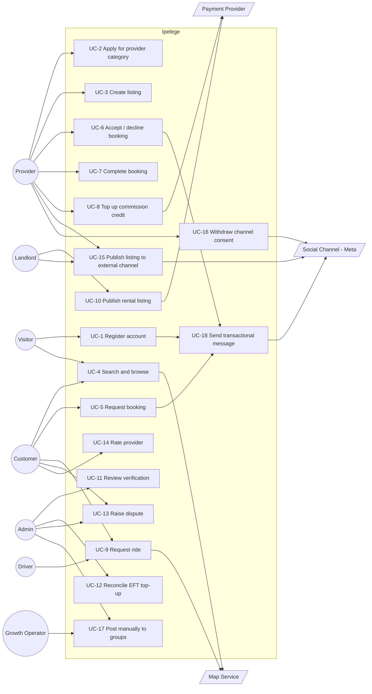

# Use cases

## Actors

| Actor | Description |
|---|---|
| **Visitor** | Unregistered user browsing the app |
| **Customer** | Registered user booking services (default role for every account) |
| **Provider** | Registered user verified in one or more categories |
| **Driver** | Provider verified in the rides category — specialised flows |
| **Landlord** | Provider verified in the rentals category — listing-fee model, no bookings |
| **Admin** | Internal staff: verification, disputes, reconciliation |
| **Payment Provider** | External — Orange Money, card gateway, bank (EFT) |
| **Map/Routing Service** | External — geocoding, routing, live tracking |
| **Social Channel** | External — Meta: Facebook Page (Graph API) and WhatsApp Business Platform |
| **Growth Operator** | Internal staff posting manually to Facebook groups — the Groups API no longer permits automation |

## Use case diagram

---

## UC-1 · Register account

| | |
|---|---|
| **Actor** | Visitor |
| **Goal** | Obtain a usable account |
| **Precondition** | Has a Botswana mobile number |
| **Postcondition** | Verified account exists with customer role |
| **Requirements** | FR-1.1, FR-1.2, FR-1.3, FR-1.10 |

**Main flow**
1. Visitor enters phone number and name
2. System presents consent notice; visitor grants required consents
3. System sends OTP
4. Visitor enters OTP
5. System verifies, creates account with customer role, records consent version
6. System signs the user in

**Alternate flows**
- **1a. Number already registered** → offer sign-in instead
- **3a. OTP not received** → resend, rate-limited; after N attempts, lock for a cooldown
- **4a. OTP incorrect** → allow retries up to limit, then invalidate and restart
- **2a. Consent declined** → registration cannot proceed; explain why

---

## UC-2 · Apply for provider category

| | |
|---|---|
| **Actor** | Customer (becoming Provider) |
| **Goal** | Be verified to offer services in one category |
| **Precondition** | Verified account |
| **Postcondition** | Verification request pending, or category approved |
| **Requirements** | FR-1.4, FR-1.5, FR-1.10, NFR-8 |

**Main flow**
1. User selects a category
2. System displays the document requirements for that category
3. User uploads documents and grants processing consent
4. System stores documents encrypted, creates a pending verification
5. Admin reviews (see UC-11)
6. On approval, the category becomes active for the user

**Alternate flows**
- **1a. Category already approved** → offer listing creation instead
- **1b. Category already pending** → show status
- **5a. Rejected** → user notified with reason, may resubmit
- **6a. Later revoked** → active listings in that category are deactivated

**Notes** — requirements differ per category: driving licence and vehicle
registration for rides; proof of ownership for rentals; trade certification for
trades where applicable; identity only for others.

---

## UC-5 · Request booking

| | |
|---|---|
| **Actor** | Customer |
| **Goal** | Secure a service from a chosen provider |
| **Precondition** | Listing is active; provider has sufficient commission balance |
| **Postcondition** | Booking exists in REQUESTED state |
| **Requirements** | FR-3.3, FR-3.4, FR-5.10 |

**Main flow**
1. Customer opens a listing
2. Customer selects service direction from those the listing offers
3. Customer supplies location (if provider travels) and preferred time
4. System validates provider balance covers the commission
5. System creates booking in REQUESTED and notifies the provider
6. Provider accepts (UC-6); booking moves to ACCEPTED

**Alternate flows**
- **4a. Provider balance insufficient** → listing shown as unavailable; provider
  notified to top up. *The customer is never told the reason.*
- **6a. Provider declines** → booking DECLINED; customer offered alternatives
- **6b. No response within timeout** → booking EXPIRED
- **3a. Location outside provider's service area** → warn and block

---

## UC-7 · Complete booking

| | |
|---|---|
| **Actor** | Provider, Customer |
| **Goal** | Mark service delivered and settle commission |
| **Precondition** | Booking in IN_PROGRESS |
| **Postcondition** | Booking COMPLETED; commission posted to ledger |
| **Requirements** | FR-3.7, FR-5.4, FR-5.6, FR-5.8 |

**Main flow**
1. Provider marks the service complete
2. System notifies customer to confirm
3. Customer confirms
4. System posts a balanced journal entry: debit provider commission credit,
   credit platform revenue — idempotent on booking ID
5. Booking moves to COMPLETED
6. Customer is prompted to rate (UC-14)

**Alternate flows**
- **3a. Customer does not confirm within the window** → auto-confirm after N
  hours, flagged in admin
- **3b. Customer disputes** → booking DISPUTED, commission posting held, UC-13
- **4a. Balance now insufficient** → post anyway, allowing negative balance;
  provider blocked from new bookings until settled
- **4b. Duplicate submission** → idempotency key prevents a second posting

> **Design note.** Payment for the service is settled directly between customer
> and provider, outside the platform. Completion is therefore a *service*
> event, not a payment event. This is deliberate — see
> [compliance](compliance.md).

---

## UC-8 · Top up commission credit

| | |
|---|---|
| **Actor** | Provider |
| **Goal** | Increase available commission balance |
| **Precondition** | Approved in at least one category |
| **Postcondition** | Balance increased; journal entry posted |
| **Requirements** | FR-5.1, FR-5.2, FR-5.6, FR-5.8, NFR-4, NFR-7 |

**Main flow (Orange Money)**
1. Provider enters amount, selects Orange Money
2. System creates a pending top-up with a unique reference
3. System calls the payment provider API
4. Provider authorises on their handset
5. Payment provider sends a callback
6. System validates the callback, posts a balanced journal entry, marks the
   top-up settled
7. Balance view reflects the new total

**Main flow (EFT)**
1–2. As above, selecting EFT
3. System displays bank details and the unique reference
4. Provider transfers via their bank
5. Admin reconciles the deposit against the reference (UC-12)
6. On match, journal entry posted and top-up settled

**Alternate flows**
- **5a. Callback never arrives** → pending top-up reconciled by a scheduled job
  querying the provider
- **5b. Duplicate callback** → idempotency key; no second posting
- **6a. EFT amount mismatch** → held for admin decision; never auto-posted
- **6b. Missing or wrong reference** → unmatched queue for manual handling

> EFT is the operationally expensive path — steps 4–6 are manual unless instant
> EFT is available through the gateway. See [payments](payments.md).

---

## UC-9 · Request ride

| | |
|---|---|
| **Actor** | Customer, Driver |
| **Goal** | Get from pickup to destination |
| **Precondition** | Customer verified; drivers available nearby |
| **Postcondition** | Trip completed; commission posted |
| **Requirements** | FR-4.1–FR-4.5, FR-3.10 |

**Main flow**
1. Customer sets pickup and destination
2. System estimates distance, duration and fare
3. Customer confirms request
4. System offers the request to nearby available drivers with sufficient balance
5. A driver accepts; trip assigned
6. Customer sees driver identity, vehicle and live location
7. Driver arrives; trip starts; route is recorded
8. Driver ends trip at destination
9. Customer pays the driver directly
10. Commission posted from driver's balance

**Alternate flows**
- **4a. No driver accepts** → widen radius, then fail with a clear message
- **5a. Driver cancels after accepting** → re-offer; repeated cancellation
  affects driver standing
- **7a. Customer no-show** → driver can cancel with reason after a wait period
- **6a. Tracking signal lost** → last known position shown with timestamp; trip
  continues

---

## UC-10 · Publish rental listing

| | |
|---|---|
| **Actor** | Landlord |
| **Goal** | Advertise an available room or unit |
| **Precondition** | Verified in rentals category; sufficient balance |
| **Postcondition** | Listing live; listing fee charged |
| **Requirements** | FR-2.6, FR-2.7, FR-2.8, FR-5.12 |

**Main flow**
1. Landlord creates a listing for one room or unit
2. Landlord adds location, price, photos, availability date
3. System shows the listing fee and requests confirmation
4. Landlord confirms
5. System posts the fee to the ledger and publishes the listing
6. Listing expires after the defined period

**Alternate flows**
- **4a. Insufficient balance** → prompt to top up; listing saved as draft
- **6a. Landlord renews** → fee charged again
- **2a. Property not yet verified** → listing held pending verification

---

## UC-11 · Review verification

| | |
|---|---|
| **Actor** | Admin |
| **Goal** | Approve or reject a provider category application |
| **Precondition** | Pending verification exists |
| **Postcondition** | Category approved or rejected; audit entry written |
| **Requirements** | FR-1.7, FR-6.1, FR-6.6, NFR-8 |

**Main flow**
1. Admin opens the pending queue
2. Admin views the submitted documents (access logged)
3. Admin checks documents against category requirements
4. Admin approves
5. System activates the category, notifies the user, writes an audit entry

**Alternate flows**
- **4a. Reject** → reason recorded, user notified, resubmission permitted
- **4b. Request more information** → returned to applicant, stays pending
- **3a. Suspected fraudulent document** → escalate; account flagged

---

## UC-15 · Publish listing to external channel

| | |
|---|---|
| **Actor** | Provider / Landlord, Social Channel |
| **Goal** | Reach customers where they already are, without leaking the transaction |
| **Precondition** | Listing active; provider has opted in |
| **Postcondition** | External post exists and is linked to the listing |
| **Requirements** | FR-2a.1 – FR-2a.5, FR-2.10 |

**Main flow**
1. Provider creates a listing
2. System offers external publication as an explicit opt-in, **defaulted off**,
   explaining what will be shared
3. Provider opts in; system records versioned consent
4. System composes the post **from structured fields only** — category, area,
   price band, photo, deep link
5. System screens the chosen photo for visible contact details
6. System publishes to the Facebook Page via Graph API
7. System stores the external post reference against the listing

**Alternate flows**
- **3a. Provider declines** → listing publishes in-app only; never asked again
  for that listing
- **5a. Photo flagged** → excluded; post published without it, or held
- **6a. API failure** → retry with backoff; **failure must never block the
  in-app listing**
- **6b. Token expired** → alert admin; queue the post
- **7a. Listing edited later** → update or replace the external post
- **7b. Listing expires or is deactivated** → remove the external post

> The post must never contain a phone number, email, handle, exact address or
> provider full name. Composing from structured fields rather than free text is
> what makes this enforceable rather than aspirational.

---

## UC-16 · Withdraw channel consent

| | |
|---|---|
| **Actor** | Provider / Landlord |
| **Goal** | Stop appearing on external platforms |
| **Precondition** | Consent previously granted |
| **Postcondition** | Consent withdrawn; existing external posts removed |
| **Requirements** | FR-2a.6, FR-1.10 |

**Main flow**
1. Provider opens privacy settings
2. Provider withdraws external-channel consent
3. System marks consent withdrawn, with timestamp
4. System deletes all external posts for that provider's listings
5. System confirms removal to the provider

**Alternate flows**
- **4a. Deletion fails via API** → retry; if still failing, escalate to admin for
  manual removal and tell the provider it is in progress. **Do not report
  success that has not happened.**

> Withdrawal is a data-protection right, not a preference toggle. The delete
> path must be built and tested with the same care as the create path.

---

## UC-17 · Post manually to groups

| | |
|---|---|
| **Actor** | Growth Operator |
| **Goal** | Reach the audience that actually exists — Facebook groups |
| **Precondition** | Consented listings available |
| **Postcondition** | Posts made; activity logged |
| **Requirements** | See [distribution](distribution.md) |

**Main flow**
1. Operator opens a queue of consent-approved, post-ready listings in admin
2. Operator copies the pre-composed teaser text and image
3. Operator posts into a relevant group, varying wording per group
4. Operator records where and when it was posted

**Alternate flows**
- **3a. Group prohibits commercial posts** → skip; mark the group as unusable
- **3b. Daily posting limit reached** → stop. Roughly 3–5 groups per day, spaced
  out; identical text across groups triggers spam detection
- **3c. Account restricted** → pause all group activity and review

> This exists as a use case because the Groups API was withdrawn in April 2024.
> It is a **staffed operational role**, not an automated feature — the admin
> panel supports it but cannot perform it.

---

## UC-18 · Send transactional message

| | |
|---|---|
| **Actor** | System, Social Channel |
| **Goal** | Reach a user reliably on a channel they already use |
| **Precondition** | User consented to messaging |
| **Postcondition** | Message delivered or failure recorded |
| **Requirements** | FR-1.2, FR-3.4, NFR-1 |

**Main flow**
1. An event occurs — OTP required, booking requested, booking accepted,
   completion confirmation needed
2. System selects the approved template for the event
3. System sends via WhatsApp Business Platform (or SMS fallback)
4. System records delivery status

**Alternate flows**
- **3a. Recipient not on WhatsApp** → fall back to SMS
- **3b. Template rejected or not yet approved** → fall back to SMS; alert admin
- **3c. Delivery fails** → retry per policy, then fall back

> Use **utility** and **authentication** templates for these. Marketing
> templates carry no volume discount and are not appropriate for transactional
> messaging.

---

## Use cases documented in brief

| ID | Name | Notes |
|---|---|---|
| UC-3 | Create listing | Standard CRUD within a verified category |
| UC-4 | Search and browse | Category, location, direction filters |
| UC-6 | Accept / decline booking | Covered within UC-5 |
| UC-12 | Reconcile EFT top-up | Admin matches bank deposit to reference; see UC-8 |
| UC-13 | Raise dispute | **Flow not yet designed — see [open questions](open-questions.md)** |
| UC-14 | Rate provider | **Not yet specified** |
