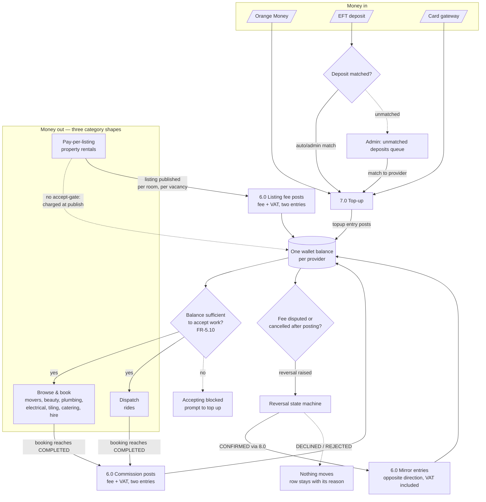
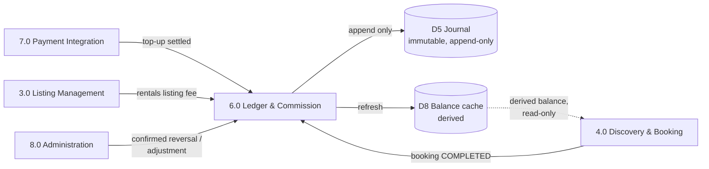

# The wallet system

> Added 2026-08-19. Consolidates the wallet logic that was previously spread
> across [monetization](monetization.md), [dfd](dfd.md),
> [system-flowcharts](system-flowcharts.md) and [admin](admin.md). Nothing here
> is new policy — it is the single flow view those documents assume but none
> draws end to end. The one decision recorded here as *settled* is ledger-account
> granularity.

## The settled decision: one wallet per provider

**A provider holds exactly one wallet balance, spanning every category.** Not one
per category. In the ledger this is `LEDGER_ACCOUNT` with
`owner_type = provider`, `owner_ref = provider_id`, and no category component in
the key — a strict 1:1 with the provider account.

This is corroborated three ways, so it is not a lone call:

| Source | What it says |
|---|---|
| [data-model.md](data-model.md) | `USER \|\|--\|\| LEDGER_ACCOUNT` — a 1:1 relationship |
| Design canvas (`design/ipelege-ds-1-foundations.dc.html`) | *"One balance, every fee… a provider funds **one wallet balance** and every Ipelege charge is drawn from it, wherever in the app it originates."* Called out as the **load-bearing** decision. |
| Product decision, 2026-08-19 | One wallet for all — confirmed in session. |

**Why it matters structurally.** The grain sets the ledger's primary key and
every balance query. One-per-provider keeps top-ups unambiguous (there is only
one balance to credit), keeps the "accept work" gate a single check, and matches
what the design already built — the wallet is one surface, hanging off the
provider dashboard, gating all categories at once
([routes.dart](../app/lib/routing/routes.dart), the provider home header).

**Per-category reporting, if ever needed, does not require splitting the
account.** It rides on `JOURNAL_TRANSACTION` (which carries `type` and
`source_ref`) — the category a fee came from is recoverable from the entry, not
from a second account. So reporting never forces a schema change here.

## The whole flow, one picture

Money enters the wallet one way (top-up), and leaves it three ways — one per
category *shape*, not per category. A confirmed reversal is the only path that
puts money back after a fee has posted.

Read the three "money out" branches carefully, because **they are not the same
shape** ([system-flowcharts](system-flowcharts.md#not-every-category-traverses-these-machines)):

- **Browse & book** and **dispatch** both post **commission on completion** —
  once, on entry to `COMPLETED`, keyed idempotently on booking ID. Dispatch
  (rides) differs only in how the booking is *entered* (the request fans out to
  nearby drivers with sufficient credit); the wallet mechanics are identical.
- **Pay-per-listing** (rentals) **never enters the booking machine.** There is
  no booking, no commission, no completion — only a **listing-fee** transaction
  at publication, charged per room / per vacancy. A rentals listing produces a
  wallet deduction with no booking row behind it. Any code assuming every
  deduction has a booking is wrong.

All three deductions post the **same way**: fee and VAT as **two separate journal
entries in one transaction**, never a bundled figure, at the rate effective on
the transaction's own date ([monetization](monetization.md#rates-and-vat)).

## Refunds are reversals, and they are adjudicated

**A cancellation does not refund itself.** A refund only becomes relevant once a
fee has already been deducted — a ride called off after dispatch, a disputed
completion, a rental listing withdrawn after publishing. In none of those does
the credit return on its own.

A reversal is a separate, reviewed, adjudicated event. While it runs:

| Rule | |
|---|---|
| **The balance does not move** | Not on `RAISED`, not on `UNDER_REVIEW`. Only `CONFIRMED` changes it. |
| **The ledger carries a pending marker with no amount** | An amount would imply money already returned. |
| **A confirmed reversal mirrors the original line for line** | Fee credited back and VAT credited back — same figures, opposite direction, both referencing the original transaction. Never one merged credit. |
| **DECLINED stays on the ledger with its reason** | A declined reversal is a record, not a deletion. |

Most reversals are decided on **evidence, not assertion** — automatic rules run
first (`EVALUATED`), and only inconclusive, suspect or contested cases reach a
human (`UNDER_REVIEW`). Full machine and evidence rules:
[system-flowcharts](system-flowcharts.md#reversal-state-machine) and
[cancellation](cancellation.md).

## Where the wallet meets the admin side

**The admin side is not an independent back office** — almost every wallet-moving
action exists to unblock a provider sitting in the app. Adjudication is
**admin, desktop-side**; the phone shows status and reason and **never a decision
control**. Cross-checked against [admin.md](admin.md#the-adminapp-loop):

| Admin action | Wallet effect | Journal | App |
|---|---|---|---|
| **Match an unmatched deposit** | Balance **increases** | `TOPUP` → `settled`; topup entry posts | Balance animates (`motion.count`, 600ms) — one of only two moments the balance moves on screen |
| **Confirm reversal** | Balance **increases** back | Reversing entries post (fee + VAT, mirrored) | **Sequenced:** reversal rows land *first*, then the balance moves — the order the events happened in |
| **Decline reversal** | Balance **unchanged** | Reversal → `declined`, row retained with reason | Nothing moves, and must not |
| **Resolve dispute (for provider)** | Balance **decreases** | Commission posts on transition to `COMPLETED` | Push to both parties |
| **Resolve dispute (for customer)** | Balance **unchanged** | Commission released, never posted | Instant, terminal |
| **Refund an unmatched deposit** | No wallet effect | Deposit never settled into a balance | Handled in the deposit queue, not the ledger |

Two invariants hold this together, both already in the specs:

1. **Only process 6.0 writes to the journal, and only by appending.** A confirmed
   reversal is an *instruction* from Administration (8.0) to Ledger (6.0), which
   posts through the same idempotent path as every other entry. Admin never
   writes the journal directly — in the database the app role holds no `UPDATE`
   or `DELETE` on the ledger tables at all
   ([database](database.md#1-the-journal-is-append-only-enforced-by-privilege)).
2. **Every wallet-moving transition emits a domain event**, and the push is
   produced from that event — never written inline in the admin action. Push is a
   hint; every balance screen must reach the correct state by **refresh alone**
   ([dfd](dfd.md#note-on-100--this-is-the-adminapp-join)).

## Wallet data flow (which processes touch the balance)

Aligned with the Level-1 processes in [dfd.md](dfd.md#level-1--major-processes)
— this is the wallet slice of that diagram.

**The balance is derived, never authoritative.** D8 is a cache refreshed from the
journal; the journal (D5) is the truth. The "accept work" gate in 4.0 reads the
derived balance but can never write it. This is why a reversal that is only
`UNDER_REVIEW` shows a pending marker with no figure — the cache has not moved,
because no journal entry has been appended yet.

## Open — what this document does *not* settle

The **grain** is settled; these remain open and are tracked in their home docs:

- **Negative balances** — permitted, and in which states? Currently assumed *yes,
  on completion only*. See [data-model](data-model.md#open).
- **Minimum wallet top-up** — not set. See [monetization](monetization.md#open).
- **Whether commission varies by category** — only rides (8%) has a rate; the
  other booking categories have none yet.
- **Reversal policy** — who may raise one, within what window, which causes
  reverse automatically, and whether **partial reversals** exist. See
  [system-flowcharts](system-flowcharts.md#open).
- **No-show fee** — whether one applies at all, given the platform never touches
  the customer's money.
- **Naming** — calling the balance a "wallet" contradicts a binding constraint in
  [compliance](compliance.md); the design reversed it and defends the position
  structurally. Unsettled, and bound to the EPS licensing question for counsel.
  This is a *label and legal* question — it does not change the schema, which
  stores a balance regardless of what the UI calls it. See
  [design-deltas](design-deltas.md#3-wallet-balance-not-commission-credit).
